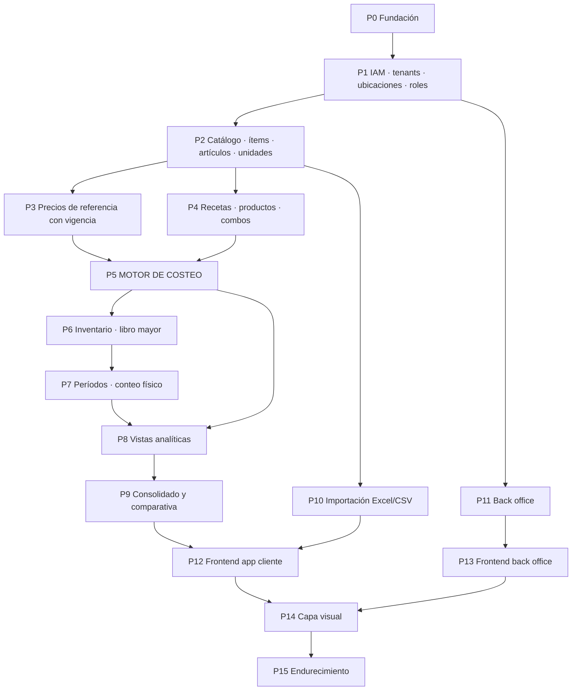

# PLAN-IMPLEMENTACION.md — Paquetes P0 a P15

> Un commit por paquete. Cada uno se cierra con el protocolo de 7 fases de `docs/PROTOCOLO.md` y su evidencia en `docs/pasos/P{n}/`.
> **El camino crítico es P5 (motor de costeo).** Todo lo anterior existe para alimentarlo y todo lo posterior para mostrarlo.

## Diagrama de dependencias

---

## P0 — Fundación del repositorio

**Objetivo.** Dejar el repositorio en un estado donde escribir código malo sea difícil.

**Entregables.**
- Monorepo con TypeScript en modo estricto máximo (`strict`, `noUncheckedIndexedAccess`, `exactOptionalPropertyTypes`)
- `npm run audit` completo: types, lint, forbidden, arch, deadcode, complexity, duplication, tests, secrets
- Pre-commit hook que bloquea en rojo · CI que corre lo mismo
- `dependency-cruiser` con las reglas de capa de `CLAUDE.md` §2
- Reglas propias de `audit:forbidden` para este proyecto: cliente de BD fuera de la capa de tenant · `UPDATE`/`DELETE` sobre tablas del libro de inventario · punto flotante para dinero
- Docker Compose con versiones fijadas · `.env.example` con selectores `*_ADAPTER=fake|real` · `infrastructure/fakes/`
- Logging estructurado JSON con `correlation_id` de punta a punta · healthcheck y readiness
- Tabla de auditoría append-only y su puerto
- Base de seguridad: helmet/CSP, rate limiter, timeouts, formato único de error
- Tipo `Money` con aritmética decimal exacta y sus pruebas
- **Dos roles de base de datos separados desde el inicio**: uno para migraciones (dueño de las tablas) y uno para la aplicación (**no superusuario, no dueño**)

**Criterio de aceptación.**
`npm run audit` pasa en verde · `docker compose up` levanta la aplicación sin una sola credencial real · un import de `infrastructure` desde `domain` **rompe el build** · un test que intenta sumar dinero con punto flotante falla · **ADR-001 existe con las seis verificaciones de versiones confirmadas y sus fechas de fin de soporte** (D2) · la aplicación se conecta con un rol que **no** es superusuario, verificado por test

**Prompt sugerido.**
> Ejecuta P0 de docs/PLAN-IMPLEMENTACION.md siguiendo el protocolo completo. En la fase PLAN, primero resuelve D2 de DECISIONES.md: confirma en fuentes oficiales los seis puntos de la tabla de CLAUDE.md §1 (las versiones propuestas ahí NO están verificadas), elige en cada caso la de soporte más largo y escribe ADR-001 antes de tocar el package.json. Si descubres que Prisma ya tiene soporte RLS nativo, detente y avísame: cambia D12.

---

## P1 — IAM, multi-tenancy, ubicaciones y roles

**Objetivo.** El aislamiento funciona antes de que exista un solo dato de negocio.

**Entregables.**
- Companies, usuarios, sesiones (Argon2id, revocación, bloqueo progresivo)
- **RLS deny-by-default** habilitado antes de la primera tabla de negocio
- **Las tres barreras de `CLAUDE.md` §4.1 completas**: RLS deny-by-default + `FORCE ROW LEVEL SECURITY` + rol de aplicación no-superusuario (barrera 1); envoltorio único de transacción-con-tenant vía `$extends`, verificado por `audit:forbidden` (barrera 2); tenant desde la sesión, nunca desde la petición (barrera 3)
- **Prueba del escenario PgBouncer en modo transacción** con `?pgbouncer=true`: verificar que el `SET LOCAL` se mantiene atado a la conexión que ejecuta la consulta
- **ADR-002** con la decisión de ORM (D12) y las condiciones que la sostienen
- Ubicaciones con tipo `BODEGA` / `LOCAL` / `AMBOS`
- Roles `OWNER`, `ADMIN` (N por company), `GERENTE_LOCAL`, `BODEGA`, `LECTURA` como capacidades, no como enum rígido
- Log de accesos con IP, dispositivo y geolocalización aproximada

**Criterio de aceptación.**
Test con dos companies: ninguna consulta de A devuelve datos de B, ni siquiera con IDs de B en la petición · **un caso de uso que olvida la capa de tenant devuelve cero filas, no las filas de otro tenant** (lo garantiza RLS, no el ORM) · un caso de uso que usa el cliente crudo falla la auditoría · **el mismo test pasa con PgBouncer en modo transacción** · `GERENTE_LOCAL` de la ubicación 1 recibe 403 sobre recursos de la ubicación 2 · dos `ADMIN` coexisten y ninguno puede eliminar al `OWNER`

---

## P2 — Catálogo: ítems, artículos de compra, unidades

**Objetivo.** La fuente única de verdad del proyecto.

**Entregables.**
- `item` con tipo `COMPRADO` / `PRODUCIDO`, unidad de uso, rendimiento, grupo, estado
- `purchase_article`: marca, presentación, proveedor, factor de conversión, N artículos → 1 ítem
- Unidades y conversiones como catálogo, no como cadenas de texto
- Campo `confianza_precio` (mapea el tipo `SUP` del Excel: precio estimado sin factura)
- Índice GIN + `pg_trgm` sobre nombre normalizado, para la deduplicación de P10

**Criterio de aceptación.**
Tres artículos de distinta marca apuntan al mismo ítem y en la pantalla de recetas aparece solo el ítem · ningún otro módulo escribe en las tablas de catálogo, verificado por `dependency-cruiser` · una conversión inválida (kg → unidades sin factor) se rechaza en el dominio

---

## P3 — Precios de referencia con vigencia

**Objetivo.** Que los reportes históricos no muten.

**Entregables.**
- `reference_price`: fila con `valid_from`, `origen` (`MANUAL` / `ULTIMA_COMPRA` / `EXTERNO`), autor y fecha de confirmación
- Consulta de precio vigente a una fecha dada
- Sugerencia de actualización cuando el precio real de compra se desvía, **sin aplicarla**
- Cadena de costo del ítem (SPEC §12): precio neto de IVA → costo bruto por unidad de uso → costo neto por rendimiento → sobrecosto por merma
- `company_settings` con los parámetros de D3

**Criterio de aceptación.**
Cambiar el precio de un ítem hoy **no altera** el costo calculado para un mes anterior · un precio nunca pasa a vigente sin confirmación explícita · con `iva_recuperable = false` el costo sube exactamente el porcentaje del IVA · R5 y R13 verificadas

---

## P4 — Recetas, productos y combos

**Objetivo.** La composición de lo que se vende, con sus reglas de integridad.

**Entregables.**
- `product` (maestro de company) · `product_location` (activación, PVP, rendimiento por lote) · `recipe` por par (producto, ubicación), versionada por vigencia
- Líneas de receta apuntando a ítems, con `cantidad`, `base` (`AP` / `EP`) y `estado` (`ACTIVA` / `EXCLUIDA`)
- Productos `SIMPLE` y `COMBO`; el combo referencia productos simples, no ítems
- **Validación de ciclos al guardar**, directa e indirecta (R9)
- Propagación entre ubicaciones: previsualización con ubicaciones afectadas y cuáles están personalizadas, permiso de nivel company, sobrescritura completa, registro reversible (R11)

**Criterio de aceptación.**
Una receta que se referencia a sí misma a través de dos niveles se rechaza al guardar con error de dominio · propagar crea una versión nueva en cada ubicación y las versiones anteriores siguen consultables · un `GERENTE_LOCAL` recibe 403 al intentar propagar · revertir una propagación devuelve cada ubicación a su versión previa

---

## P5 — MOTOR DE COSTEO ⭐ camino crítico

**Objetivo.** El cálculo correcto, demostrable y sin base de datos.

**Entregables.**
- Todo en `modules/costing/domain`, **sin una sola importación de infraestructura**
- Costo de línea con la condicional AP/EP (R4)
- Costo bruto y neto del lote, costo por porción, merma no atribuible, empaque neto, costo total por unidad
- Venta neta, margen de contribución, MC%, food cost%, suma de control, multiplicador, impacto de la merma
- Cascada de costo para ítems `PRODUCIDO` con costo estándar (R10)
- Costo de combos como suma de componentes

**Criterio de aceptación.**
Las pruebas del motor corren **con PostgreSQL apagado** · todos los casos de `docs/pruebas/casos-conocidos.md` dan el resultado calculado a mano desde el Excel · la suma de control da exactamente 1 para todo producto (R6) · existe un test con el mismo ítem en base AP y en base EP que produce **resultados distintos y ambos correctos** (R4) · un producto cuyo rendimiento es 0 no divide por cero

**Prompt sugerido.**
> Ejecuta P5. Antes de escribir código, lee docs/SPEC.md §12 a §15 completo y escribe primero docs/pruebas/casos-conocidos.md con al menos 8 casos calculados a mano, incluyendo AP y EP, una subpreparación anidada y un combo. Después implementa el motor contra esos casos.

---

## P6 — Inventario: libro mayor append-only

**Objetivo.** Saber cuánto hay y por qué, sin poder mentir.

**Entregables.**
- `inventory_movement` append-only: `COMPRA`, `TRANSFERENCIA_SALIDA`, `TRANSFERENCIA_ENTRADA`, `PRODUCCION`, `MERMA`, `AJUSTE`, `CONSUMO_POR_VENTA`
- Saldo por (ubicación, ítem) como **proyección** del libro, nunca campo mutable (R3)
- Transferencias entre ubicaciones como par de movimientos atómico
- Producción: consume insumos y da de alta la preparación, registrando el **costo real del lote** frente al costo estándar (R10)
- Interruptor por preparación: con stock o sin stock (explota la receta al vender)
- Corrección por movimiento de signo contrario; nunca edición

**Criterio de aceptación.**
No existe `UPDATE` ni `DELETE` sobre la tabla de movimientos, verificado por `audit:forbidden` · una transferencia deja el total de la company intacto y cambia los saldos de las dos ubicaciones · el saldo de una ubicación es independiente del de otra (R2) · reconstruir el saldo desde el libro da el mismo número que la proyección

---

## P7 — Períodos y conteo físico

**Objetivo.** Poder cerrar un mes y compararlo con el siguiente.

**Entregables.**
- Período mensual con estados abierto / cerrado; cerrado es de solo lectura (D6)
- Conteo físico por ubicación, **parcial permitido** (D7), con porcentaje del valor efectivamente contado
- **Conteo a ciegas para el rol `BODEGA`**: la pantalla de conteo no recibe del backend el stock teórico ni ningún derivado (R8)
- Reapertura solo por `OWNER`, registrada

**Criterio de aceptación.**
Un movimiento con fecha en período cerrado se rechaza · la respuesta cruda del endpoint de conteo autenticado como `BODEGA` no contiene stock teórico, diferencia ni valorización · un conteo parcial produce food cost real con su indicador de cobertura

---

## P8 — Vistas analíticas

**Objetivo.** Las seis vistas del Excel, por ubicación.

**Entregables.**
- Food cost real y varianza (SPEC §16), **incluida la conciliación que debe dar 0** (R7)
- Menu engineering Kasavana-Smith con los cuatro cuadrantes (SPEC §15)
- Punto de equilibrio, prime cost y margen de seguridad (SPEC §17), con clasificación explícita de costos fijos (`MANO_DE_OBRA` / `OTRO_FIJO` / `VARIABLE`), **no por prefijo de texto**
- Inventario valorizado con estados y días de cobertura (SPEC §18)
- Resumen gerencial
- Proyecciones por rol: la versión de `BODEGA` excluye los campos de `CLAUDE.md` §4.3

**Criterio de aceptación.**
**La conciliación da exactamente 0 con un dataset completo, como prueba automatizada que corre en cada build** (R7) · un producto con índice de popularidad exactamente 1 cae en el cuadrante correcto de forma determinista · cada endpoint tiene su test de confidencialidad frente a `BODEGA` (R8)

---

## P9 — Consolidado de company y comparativa entre ubicaciones

**Objetivo.** Ver la cadena completa y comparar locales.

**Entregables.**
- Agregación de ventas, costos e inventario de todas las ubicaciones de una company
- Comparativa del mismo producto entre ubicaciones (`GROUP BY product_id`): PVP, food cost, margen y unidades
- Comparativa de precios de compra del mismo ítem entre ubicaciones y entre artículos/marcas
- Vistas materializadas para períodos cerrados

**Criterio de aceptación.**
El consolidado es exactamente la suma de las ubicaciones, verificado por test · ninguna agregación cruza companies (R1) · el consolidado de 10 ubicaciones cumple el presupuesto p95 de 800 ms con volumen sintético realista

---

## P10 — Importación Excel/CSV

**Objetivo.** Que un cliente nuevo pueda cargar 200 ítems sin digitarlos.

**Entregables.**
- Importación de ítems, artículos, productos, recetas y movimientos
- **Etapa de validación con previsualización antes de escribir**: filas válidas, filas con error y motivo
- Detección de duplicados por similitud usando el índice trigram de P2
- Resolución de unidades y factores de conversión en la previsualización
- Escritura en una sola transacción reversible
- Rechazo explícito de filas con tipo `LNK` mientras D4 siga abierta

**Criterio de aceptación.**
Un archivo con "Tomate riñón", "tomate riñon" y "TOMATE" propone **un** ítem con tres alias, no tres ítems · un archivo con una fila inválida en la posición 150 no escribe ninguna de las 149 anteriores · un archivo de 5.000 filas no bloquea el proceso principal

---

## P11 — Back office

**Objetivo.** Poder operar el negocio y dar soporte sin romper el aislamiento.

**Entregables.**
- Gestión de companies, planes y límites · alta de tenant con semilla de parámetros (D3)
- Conexión privilegiada **con pool separado**, aislada en su propio proceso
- Log append-only de todo acceso cross-tenant: usuario, company, motivo obligatorio, timestamp, IP
- Carga de datos dentro de un tenant desde el back office

**Criterio de aceptación.**
Existe un test que verifica que **ningún módulo de la app cliente importa la conexión privilegiada** · toda operación cross-tenant deja registro con motivo · el registro no se puede editar ni borrar

---

## P12 — Frontend app cliente

**Objetivo.** Que el cliente pueda usar el sistema. Funcional, sin estilizar.

**Entregables.**
- Tokens desde el primer componente; cero estilos literales
- Catálogo, artículos, recetas con propagación, productos y combos
- Inventario: compras, transferencias, producción, mermas, conteo físico
- **Grilla de unidades vendidas** con período anterior precargado, navegación por teclado y guardado incremental
- Las seis vistas + consolidado + comparativa
- Vistas diferenciadas por rol; `BODEGA` no recibe los campos prohibidos

**Criterio de aceptación.**
Cargar 48 productos en la grilla de ventas se hace **sin tocar el mouse** · el flujo de conteo físico es usable en un teléfono, de pie · ningún componente contiene un color, tamaño o fuente literal · abrir el inspector de red como `BODEGA` no revela ningún campo prohibido

---

## P13 — Frontend back office

**Objetivo.** Interfaz interna de administración.

**Entregables.** Gestión de tenants y planes · consola de soporte con motivo obligatorio · visor del log de accesos cross-tenant

**Criterio de aceptación.** No se puede entrar a un tenant sin escribir un motivo · el log es visible y filtrable

---

## P14 — Capa visual

**Objetivo.** Aplicar la identidad de marca definida en **`docs/Manual de Marca/platise-brand-book.pdf`** — la fuente única, ver `CLAUDE.md` §10.

**Entregables.** Reemplazo de `tokens.css` y de `components/ui` con los valores del manual · sin tocar hooks, servicios ni dominio

**Criterio de aceptación.** El diff no toca ni un archivo de `src/modules/*/domain` ni de `application` · todas las pruebas siguen en verde sin modificarse

---

## P15 — Endurecimiento

**Objetivo.** Que aguante producción.

**Entregables.**
- Volumen sintético realista: 50 companies, 10 ubicaciones, 300 ítems, 200 productos, 2 años de movimientos
- `EXPLAIN ANALYZE` de todo el camino crítico contra ese volumen
- Pentest interno guiado por OWASP Top 10 con fakes
- Respaldos **con restauración probada**, no solo configurada
- Runbooks completos con comandos exactos

**Criterio de aceptación.**
Todos los presupuestos p95 de `CLAUDE.md` §5 se cumplen con el volumen sintético · una restauración completa se ejecuta y se verifica de punta a punta · ninguna consulta del camino crítico hace *sequential scan* sobre una tabla grande

---

## Recomendación de corrida

Primera corrida en modo autónomo **hasta P5 inclusive**. Ahí está el motor de costeo, que es donde un error es caro y silencioso. Revisar los casos conocidos y los números antes de soltar el resto.
