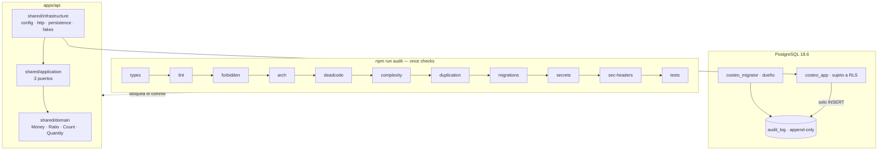

# P0 — Documento de construcción

## Resumen

| Campo | Valor |
|---|---|
| Paquete | P0 — Fundación del repositorio |
| Fecha inicio / fin | 2026-08-26 / 2026-08-27 |
| Commit final | `P0: Fundación del repositorio` |
| Secciones del SPEC implementadas | Ninguna todavía. P0 no implementa negocio: implementa las condiciones para que el negocio se escriba bien |
| Estado | ✅ completado |

## Objetivo del paquete

**Que escribir código malo sea difícil.** Al terminar P0, un import de `infrastructure` desde `domain` rompe el build, sumar dinero con punto flotante no compila, una migración sin RLS no pasa la auditoría, y la aplicación se conecta a PostgreSQL con un rol que no puede saltarse las políticas de aislamiento.

**Criterio de aceptación:** `npm run audit` en verde · `docker compose up` levanta la aplicación **sin una sola credencial real** · el dominio se prueba con la base apagada · ADR-001 existe con las seis verificaciones y sus fechas de fin de soporte.

## Qué se construyó

### Dominio — `shared/domain/`

| Elemento | Archivo | Descripción |
|---|---|---|
| Escalas decimales | `decimal/escalas.ts` | `PRESENTACION` 2 · `ALMACENAMIENTO` 12 · `DIVISION` 12 · `MAXIMA` 30, con la derivación de la cota del residuo de R7 que justifica el 12 |
| Núcleo decimal | `decimal/nucleo.ts` | **Único archivo autorizado a importar `decimal.js`.** `Decimal.clone()` inmune a la configuración global; `dividir()` es la única operación que redondea, con la escala obligatoria en la firma |
| `ValorDecimal` | `money/tipos-monetarios.ts` | Base con la API de comparación y serialización. La marca nominal **no** se hereda |
| `Money` | `money/tipos-monetarios.ts` | Importe. Sin escala fija; el redondeo solo ocurre al dividir, al persistir y al presentar |
| `Ratio` | ídem | Proporción adimensional: IVA, rendimiento, food cost %, multiplicador |
| `Count` | ídem | Entero no negativo. Única excepción que acepta `number`, validado con `Number.isSafeInteger` |
| `Quantity` | ídem | Cantidad **con su unidad pegada**. `1 kg + 1 unid` lanza en vez de dar `2` |
| `UnidadDeUso` | `unidad/unidad-de-uso.ts` | Tipo marcado + `exigirMismaUnidad` + `UnidadIncompatibleError` |
| Contrato de tipos | `money/money.type-contract.ts` | **No se ejecuta.** Cada `@ts-expect-error` afirma que la línea de debajo no compila |

`Quantity` se adelantó de P3 a P0 por decisión del usuario: el criterio de aceptación de P2 dice que una conversión inválida (kg → unidades sin factor) se rechaza en el dominio, y eso es exactamente lo que la unidad tipada resuelve. `UnitCost` sí espera a P3: no tiene consumidor antes.

### Puertos — `shared/application/ports/`

| Puerto | Implementación en P0 | Primer consumidor real |
|---|---|---|
| `AuditLogPort` | `PrismaAuditLogRepository` | P1 |
| `MailerPort` | `FakeMailer` | P1 (invitación de usuario) |
| `FileStoragePort` | `FakeFileStorage` | P10 (importación) |

Son interfaces puras: `application` no conoce NestJS, Prisma ni Express, y `dependency-cruiser` lo verifica. El token de inyección se declara junto al contrato, no junto a la implementación.

`AuditLogPort` **no tiene método de lectura**, y no es una omisión: la aplicación cliente escribe el log y no lo lee. Consultarlo es del back office (P11), y la política RLS lo hace cumplir aunque alguien añada el método.

### Infraestructura — `shared/infrastructure/`

| Adaptador | Implementa | Archivo |
|---|---|---|
| Esquema de entorno | Validación por esquema en un límite externo | `config/environment.ts` |
| Contexto de solicitud | `correlation_id` vía `AsyncLocalStorage` | `observability/request-context.ts` |
| Opciones de logger | JSON con `correlation_id`, con `redact` de autorización y cookies | `observability/logger.options.ts` |
| `PrismaConnection` | **Único sitio autorizado a construir un `PrismaClient`** | `persistence/prisma-connection.ts` |
| `PrismaAuditLogRepository` | `AuditLogPort` | `persistence/prisma-audit-log.repository.ts` |
| Cabeceras de seguridad | SEGURIDAD.md §4.4, con nonce por respuesta | `http/security-headers.ts` |
| `ErrorFilter` + `errorResponseFor` | Formato único `{ code, message }` | `http/error.filter.ts` |
| `TimeoutInterceptor` | Timeout de petición | `http/timeout.interceptor.ts` |
| `/health` y `/ready` | Liveness y readiness separadas | `health/` |
| `FakeMailer`, `FakeFileStorage` | Los dos puertos externos, con latencia y fallo simulables | `fakes/` |

### Migraciones

| Migración | Qué crea | Índices | Reversible |
|---|---|---|---|
| `20260827081537_p0_audit_log` | `audit_log` + los tres catálogos, append-only en tres capas, RLS deny-by-default + FORCE, `CHECK` de coherencia | `(at DESC)`, `(correlation_id)` | ✅ verificado por la escalera de `migrate:verify` |

### Tooling de calidad

| Pieza | Qué hace |
|---|---|
| `tools/audit/forbidden.mjs` + `rules/*.rules.mjs` | 22 reglas **como datos**. Un paquete nuevo añade la suya sin tocar el escáner |
| `tools/audit/arch.mjs` | `dependency-cruiser` **con autocomprobación**: crea un fixture que viola una regla y verifica que se detecta |
| `tools/audit/migrations.mjs` | `down.sql` presente y simétrico · toda `CREATE TABLE` con RLS · ninguna migración commiteada editada |
| `tools/audit/tests.mjs` | Unitarias siempre; integración con aviso explícito si falta la base |
| `tools/audit/lib/comentarios.mjs` | Enmascara comentarios (y opcionalmente cadenas) preservando desplazamientos |
| `scripts/lib/proceso.mjs` | Lanza CLIs de npm resolviendo el JS real. Ver INC-006 |
| `scripts/migrate-{new,down,verify}.mjs` | El mecanismo de ADR-004 |
| `tools/doctor.mjs` | Informe del entorno: tres de las incidencias de P0 son de entorno y se diagnostican mal |

## Diagrama del paquete



## Decisiones técnicas tomadas

| # | Decisión | Alternativas descartadas | Razón | ADR |
|---|---|---|---|---|
| 1 | Versiones del stack fijadas y verificadas | Confiar en la tabla de CLAUDE.md | «Prisma 6» estaba desactualizado por dos majors; Node 26 aún no promueve a LTS | [ADR-001](../../decisiones/ADR-001-versiones-del-stack.md) |
| 2 | Prisma 7.10.0, RLS en SQL manual | Prisma 8 RC · Drizzle | El RLS nativo cubre la Barrera 1, **no la Barrera 2**, que es la difícil | [ADR-002](../../decisiones/ADR-002-orm-prisma-frente-a-drizzle.md) |
| 3 | `decimal.js` acotado a una carpeta | `number` · `BigInt` en centésimas | Exactitud con escala explícita; la excepción a §2 está verificada por dos herramientas | [ADR-003](../../decisiones/ADR-003-aritmetica-decimal-con-decimal-js.md) |
| 4 | `down.sql` generado y verificado en bases reales | Restaurar respaldo | Un respaldo destruye movimientos del libro append-only | [ADR-004](../../decisiones/ADR-004-migraciones-reversibles.md) |
| 5 | `core.hooksPath` en vez de husky | husky · copiar a `.git/hooks/` | Dos líneas de git contra una dependencia con su propio ciclo de vida | [ADR-005](../../decisiones/ADR-005-hooks-con-core-hookspath.md) |
| 6 | Generador `prisma-client-js`, no el nuevo `prisma-client` | El nuevo, que es el recomendado | El nuevo emite TS que entra en la compilación: agota el heap de `tsc` y rompe `tsc --build` con TS6059 | Razonado en `schema.prisma`; entra en la reevaluación de ADR-002 |
| 7 | `DEFAULT PRIVILEGES` de `SELECT, INSERT` y no de los cuatro | Conceder los cuatro y revocar en las append-only | Fallo ruidoso antes que fallo silencioso | `grants.sql` |
| 8 | Trigger append-only **de sentencia**, no de fila | De fila | Con `FORCE RLS` y sin política de `DELETE`, un `DELETE` de la dueña afecta cero filas y un trigger de fila nunca se dispara | `modelo-datos.md` |
| 9 | Cabeceras como middleware de plataforma, no interceptor | Interceptor de Nest | Un 404 o un 429 saldrían sin cabeceras | `security-headers.ts` |
| 10 | `errorResponseFor` como función pura, separada del filtro | Probar el filtro con dobles | Los dobles de `ArgumentsHost` exigen `as unknown as`, que `audit:forbidden` prohíbe | `error.filter.ts` |
| 11 | Clase base `ValorDecimal` | Cuatro copias de la API de comparación | Cuarta repetición; el umbral de OPTIMIZACION.md §1 es la tercera | ADR-003 |

## Consultas del camino crítico

**— No aplica.** P0 no tiene ninguna consulta de negocio. La única del runtime es `SELECT 1` en la sonda de `/ready`, elegida por ser la más barata que aún demuestra que hay conexión viva y que el rol puede ejecutar. Los `EXPLAIN ANALYZE` empiezan en P2, con las primeras consultas de catálogo.

## Pruebas

| Tipo | Cantidad | Qué cubren |
|---|---|---|
| Unitarias — dominio | 98 | Núcleo decimal, `Money`/`Ratio`/`Count`/`Quantity`, comparación, redondeo medio-hacia-arriba, mini-conciliación R7 |
| Unitarias — infraestructura | 30 | Esquema de entorno, formato de error, timeout, falsos |
| Integración — base de datos | 23 | Barrera 1 (9) y append-only de `audit_log` (14) |
| Integración — HTTP | 23 | Cabeceras de §4.4 (18) y salud/errores (5) |
| **Total** | **174** | Las 128 unitarias corren **con PostgreSQL apagado** |

### La mini-conciliación R7

Tres productos **reales** del Excel de referencia, con los valores que `V_COSTEO` ya tenía calculados — no números inventados. Son además las tres primeras fichas de `docs/pruebas/casos-conocidos.md` (CC-001 a CC-003).

Dos aserciones: el contrato (`ROUND(diff, 2) = 0.00`) y un **canario** (`|diff| ≤ 1e-6`) que se rompe cinco órdenes de magnitud antes de que el contrato falle.

> **CC-004 (base AP frente a EP) no se pudo extraer:** las 293 líneas de T3 del Excel están todas en base EP. El caso se construye en P5, cuando el motor lo necesite.

## Problemas encontrados y cómo se resolvieron

| Problema | Solución | Tiempo perdido |
|---|---|---|
| `npm install` fallaba en `prepare` | Crear `tools/setup-hooks.mjs` antes de instalar | 5 min |
| npm 11 bloquea los scripts de instalación | `npm approve-scripts`; `allowScripts` versionado en `package.json` | 10 min |
| PostgreSQL 18 no arranca con el volumen en `/var/lib/postgresql/data` | Subir el montaje un nivel → **INC-005** | 25 min |
| `shell: true` en Windows concatena los argumentos; después `EINVAL` por CVE-2024-27980 | Resolver el JS del `bin` y lanzarlo con `node` → **INC-006** | 35 min |
| `--to-migrations` falla en la primera migración | Rama a `--to-empty` | 10 min |
| `pg_dump` 18 emite `\restrict` con nonce aleatorio | Normalizar antes de comparar | 15 min |
| Cuatro checks pasaban en verde sin medir nada | → **INC-007** | ~2 h |
| La comprobación del rol de `DATABASE_URL` no se ejecutaba con otro campo inválido | → **INC-008** | 25 min |
| `tsc` agotaba el heap con el generador nuevo de Prisma | Volver a `prisma-client-js` | 20 min |
| Mi cálculo a mano de `12.5 / 18.14` estaba mal | Verificado por multiplicación inversa antes de tocar la prueba | 10 min |
| `migrate:verify` fallaba con un error de sintaxis en un SQL correcto | `psql -c` no sustituye variables; el SQL entra por stdin → **INC-009** | 20 min |
| Una prueba dividía por la `venta_neta` **ya redondeada** de `V_COSTEO` | Recalcular desde el PVP. Es la ilustración concreta de por qué los intermedios no se redondean | 15 min |

## Deuda y pendientes

| Deuda | Fecha de pago | Estado |
|---|---|---|
| Lista blanca de knip para `shared/domain/**` | Se retiraba en P5 | **No hizo falta.** Aplicar YAGNI (aplazar `UnitCost` a P3, `argon2` a P1) y el hecho de que un export usado en pruebas no es código muerto la volvieron innecesaria. Queda anotado para que nadie la reintroduzca |
| Limitador de peticiones sin ruta que proteger | P1 | Cableado y en el mismo módulo que producción; su prueba llega con el primer endpoint real |
| Generador `prisma-client-js` deprecado | Con la evaluación de Prisma 8 | ADR-002 |
| Salto a Node 26 | Promueve a LTS el 2026-10-28 | Ítem C7 de FASE0-CHECKLIST. Merece su propio paquete |

## Cómo probar manualmente lo construido

```sh
# 1. Los once checks
npm run audit

# 2. El dominio, con la base APAGADA
npm run db:down && npm run test:unit

# 3. Los roles de base de datos y el append-only, contra la base real
npm run db:up && npm run migrate:deploy && npm run test:integration

# 4. Las migraciones revierten de verdad
npm run migrate:verify

# 5. El stack entero, sin una sola credencial real
docker compose up -d --build
curl -i http://localhost:3000/health     # mira las cabeceras de §4.4
curl -i http://localhost:3000/no-existe  # el 404 también las lleva
curl    http://localhost:3000/ready      # {"database":{"status":"up"}}
```

> Si el 3000 del host está ocupado, `API_PORT=3100 docker compose up -d`. `PORT` y `API_PORT` son cosas distintas a propósito: la primera es el puerto **interno** del proceso, la segunda el **publicado** en el host.

**Verificado de verdad, no solo escrito.** Con la imagen construida, el contenedor arranca en `NODE_ENV=production`, sin `MIGRATION_DATABASE_URL` en su entorno, corre como `uid=1000(node)` y se conecta con `current_user = costeo_app` y `usesuper = f`. `/ready` responde `database: up` y el 404 sale con las siete cabeceras.

Para comprobar que las defensas **fallan cuando deben**, las once salidas capturadas están en `AUDITORIA-RESULTADO.md` y en `evidencia/`.

## Incidencias registradas en este paquete

| Incidencia | Síntoma | ¿Se automatizó la prevención? |
|---|---|---|
| [INC-001](../../incidencias/INC-001-hook-pre-commit-bad-interpreter.md) | `bad interpreter: /bin/sh^M` | ✅ `.gitattributes` + regla `sin-crlf-en-archivo-posix` |
| [INC-002](../../incidencias/INC-002-psql-no-esta-en-el-path.md) | `psql: command not found` | ✅ Caída a `docker compose exec` + `npm run doctor` |
| [INC-003](../../incidencias/INC-003-binarios-win32-dentro-del-contenedor.md) | Binarios nativos de win32 en contenedor Linux | ✅ Regla `sin-bind-mount-de-codigo` + `.dockerignore` |
| [INC-004](../../incidencias/INC-004-migrate-diff-genera-down-vacio.md) | `down.sql` vacío o flags inválidos | ✅ `audit:migrations` M1 |
| [INC-005](../../incidencias/INC-005-postgres-18-cambia-el-directorio-de-datos.md) | Contenedor `unhealthy` con mensaje engañoso | ✅ Regla `postgres-18-monta-en-var-lib-postgresql` |
| [INC-006](../../incidencias/INC-006-spawn-en-windows-parte-los-argumentos.md) | SQL partido / `stderr` vacío | ✅ Regla `no-shell-en-spawn` |
| [INC-007](../../incidencias/INC-007-un-check-pasa-en-verde-sin-medir-nada.md) | Un check en verde sin examinar nada | ✅ La prueba del guardián, criterio de commit |
| [INC-008](../../incidencias/INC-008-superrefine-no-corre-si-otro-campo-fallo.md) | Regla de seguridad que falla abierto | ✅ Prueba que exige listar **todos** los problemas + regla en CLAUDE.md §3 |
| [INC-009](../../incidencias/INC-009-psql-c-no-sustituye-variables.md) | `syntax error at or near ":"` con la variable sin sustituir | ✅ `migrate:verify` es paso propio del workflow de CI |

Las cuatro primeras se registraron **antes de ocurrir**, en la fase PLAN. Las cinco últimas ocurrieron de verdad. Ninguna quedó solo documentada.
