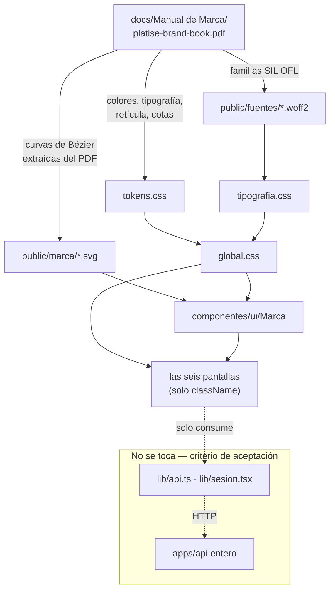

# P14 — Documento de construcción

**Paquete:** P14 — Capa visual · **Fecha:** 2026-09-08 · **Estado:** completado

---

## Resumen

Se reemplaza la capa visual neutra por la identidad de
`docs/Manual de Marca/platise-brand-book.pdf`, y se crea la capa
`componentes/ui` que `CLAUDE.md` §10 nombra y que hasta ahora no existía.

**Ni una línea de `apps/api` cambia.** Lo único que se toca fuera de `apps/web`
son seis archivos de reglas de `tools/audit/`, por un hallazgo que se explica
abajo y que no es opcional.

---

## Objetivo del paquete

Aplicar la identidad de marca sin tocar hooks, servicios, dominio ni
`application`. Criterio de aceptación del plan: *«El diff no toca ni un archivo
de `src/modules/*/domain` ni de `application` · todas las pruebas siguen en verde
sin modificarse.»*

---

## Plan aprobado

1. Leer el manual **del PDF**, no de una captura, y verificar la lectura.
2. Reescribir `tokens.css` con sus valores.
3. Reescribir `global.css` para que la apariencia viva ahí y no en las páginas.
4. Crear `componentes/ui/` con la marca, el marco de tabla y los tres estados.
5. Pasar las seis pantallas de `style={{…}}` a `className`.
6. Cerrar D1 con el nombre que el manual publica.

---

## Qué se construyó

### Tokens y hoja global

| Archivo | Qué |
|---|---|
| `src/styles/tokens.css` | Reescrito. Paleta con nombre, la tabla de tokens del manual, el semáforo, la retícula de Fibonacci, la tipografía y las cotas de la marca. Cada bloque cita su página |
| `src/styles/global.css` | Reescrito. El vocabulario de clases que usan las pantallas |
| `src/styles/tipografia.css` | **Generado.** Las diez caras de Inter e IBM Plex Mono, autoalojadas |

### La capa `ui`, que no existía

| Archivo | Qué |
|---|---|
| `componentes/ui/Marca.tsx` | `Isotipo` y `Logotipo` |
| `componentes/ui/Tabla.tsx` | El marco de tabla: panel, desplazamiento horizontal y `<table>` |
| `componentes/ui/Estados.tsx` | Movido desde `componentes/`. Cargando, vacío y error |

### Recursos

`public/marca/{isotipo,logotipo}.svg`, `public/fuentes/` con seis `.woff2`, las
dos licencias OFL y `LICENCIAS.md`.

### Migraciones

**Ninguna.** Este paquete no toca la base de datos.

---

## Diagrama del paquete



---

## Decisiones técnicas tomadas

Las seis están razonadas en **`ADR-019`**. En una línea cada una:

| # | Decisión |
|---|---|
| 1 | El panel operativo va en **claro**, sin vidrio y sin sombra. Lo decide el manual, p. 30, no el gusto |
| 2 | El semáforo usa Jade, Persimmon **Profundo** y Oxblood. Persimmon vivo solo como señal: como texto reprueba |
| 3 | **Fraunces no se sirve**: es nivel Display, de 66 a 172 px, y esta aplicación no tiene aperturas |
| 4 | Las fuentes se **autoalojan**: sin red en build y sin que el navegador del cliente hable con un tercero |
| 5 | El logotipo se **extrajo** de las curvas del PDF, no se redibujó desde las fórmulas |
| 6 | El producto se llama **Platise**. Cierra D1 |

---

## Consultas del camino crítico

Ninguna: el paquete no toca la API ni la base.

Lo que sí se midió, con navegador, porque es lo que este paquete puede romper:

| Qué | Cómo | Resultado |
|---|---|---|
| El logotipo y el isotipo se ven bien | Rasterizados con Chrome sin cabeza a 400, 140, 120 y 34 px | Correctos. La `p` es el isotipo, con su remate Persimmon |
| Las pantallas reales | Captura de `/entrar` y `/sucursal` contra el build de producción | Correctas |
| La barra y la tabla | Captura con la hoja compilada y el marcado de la pantalla de costeo | **Encontró un fallo**: ver abajo |
| Desbordamiento horizontal | `scrollWidth` contra `clientWidth` a 320 y a 500 px | Sin desbordamiento |

---

## Pruebas

**No se añadió ni se modificó ninguna prueba**, que es parte del criterio de
aceptación. Siguen **585 unitarias** y **313 de integración** en verde, con las
mismas 5 saltadas de siempre (INC-016).

Lo que sí cambió es **cuántos archivos vigila `audit:forbidden`**: 346 → 359.

---

## Problemas encontrados y cómo se resolvieron

### 1. `audit:forbidden` no había mirado nunca un archivo del frontend

**El síntoma fue un número que no se movió.** Después de añadir tres archivos y
borrar uno, el check seguía diciendo «346 archivos». `ESTADO.md` avisa de esto
con todas las letras: *«El contador de archivos de `audit:forbidden` no es
decorativo. Cuando una regla cambia de alcance, ese número tiene que moverse»*
(INC-007 caso 9).

**La causa:** todos los patrones dicen `apps/*/src/**/*.ts`. **Ninguno dice
`.tsx`.** Las 34 reglas —`: any`, `as any`, `@ts-ignore`, `eslint-disable`,
marcadores pendientes— nunca examinaron una sola de las 2.000 líneas del
frontend que construyó la Fase C.

**La corrección**, en este mismo paquete porque `CLAUDE.md` §8 lo exige: los
siete patrones pasan a `apps/*/src/**/*.{ts,tsx}` en los seis archivos de
reglas. El contador se mueve a **359**, que son exactamente los 13 `.tsx` que
faltaban.

**Y se comprobó que caza algo**, que es la otra mitad de INC-007: metiendo un
`// @ts-ignore` y un `const colado: any` en `ui/Tabla.tsx`, el check pasa de OK a
`FALLO — 2 infracciones` y las nombra con su línea. Antes de este cambio las dos
habrían pasado en silencio.

> **La lección, que es nueva y vale para todo el proyecto:** una regla con un
> glob de extensión es una regla con un alcance que caduca. El día que el
> repositorio ganó `.tsx`, treinta y cuatro reglas se quedaron mirando a otro
> lado sin que nada fallara. Lo único que lo delató fue un contador que no se
> movió.

### 2. La barra de navegación se partía en dos filas

El manual llama a `--f6` (144 px) «margen lateral», y se aplicó tal cual. Pero
esa medida es de una **lámina de 1600 × 900**: en una barra de aplicación a
1280 px, 144 px por lado dejan la navegación sin sitio y la empujan a una segunda
fila.

Se pasó a `--f3` (34 px), que sigue saliendo de la serie de Fibonacci del manual
—que es la regla— con el término que le cabe a este lienzo. **Lo encontró una
captura, no una revisión de código.**

### 3. Dos correcciones de CSS que no corregían nada, y se quitaron

Al ver una captura de móvil con el texto cortado se dedujo un desbordamiento
horizontal y se añadieron `minmax(0, 1fr)` a `.pila` y `min-width: 0` a
`.tabla-marco`, con su comentario explicando el fallo que evitaban.

**Medido después, el fallo no existía.** `scrollWidth` daba lo mismo con y sin
las dos reglas, a 500 px y a 320 px. Lo que estaba cortado era la maqueta de
prueba, que no llevaba `meta viewport`. Y la especificación coincide con la
medición: un elemento de rejilla con `overflow` distinto de `visible` ya tiene
mínimo automático cero.

**Se revirtieron las dos.** Un comentario que dice «esto evita un fallo» cuando
no lo evita es peor que no tener comentario: la próxima persona se lo cree.
Queda en su lugar una nota que dice por qué NO lleva el remiendo y que se midió.

> Es INC-007 aplicado a uno mismo: el arreglo también hay que verificarlo.

---

## Deuda y pendientes

| # | Qué | Por qué no se hizo aquí |
|---|---|---|
| 1 | **El margen de referencia se muestra con 12 decimales** (`5.482000000000`). La API lo manda a escala de almacenamiento, sin el par `mostrar`/`exacto` que sí trae el DTO de costeo | Es una carencia de la Fase C, no de la capa visual, y arreglarla bien es o un cambio de la API —que el criterio de aceptación de P14 prohíbe— o repetir en el frontend el redondeo medio-hacia-arriba que ya vive en `costeo/page.tsx`, y eso lo para `audit:duplication`. **Lo limpio es que la API publique `mostrar`** |
| 2 | La pantalla de menú tiene **prosa interpolada dentro del componente**, contra D11 | No es visual, y sacarla bien necesita un ayudante de formato. Queda anotado |
| 3 | **Fraunces no se sirve** | Decisión razonada (ADR-019 §3), reversible en diez minutos si el usuario prefiere lo contrario |
| 4 | No hay pruebas automatizadas de la capa visual | Se verificó con navegador y capturas. Una prueba de regresión visual es un paquete propio |

---

## Cómo probar manualmente lo construido

```bash
npm run build --workspace @costeo/web
npx next start -p 3200 --dir apps/web
```

Y abrir `http://127.0.0.1:3200/entrar`. Lo que hay que ver:

1. Fondo **Cloud Dancer** (`#F2F0EA`), no blanco ni gris.
2. El **logotipo** «Platise» con la panza de la `p` rota y su remate naranja.
3. La firma «El margen, plato por plato.» debajo.
4. El botón de entrar en **Persimmon Profundo**, no en azul ni en gris.
5. Los rótulos de las tablas en **versalitas monoespaciadas**, y los números
   alineados por la coma.
6. En la barra de una pantalla con datos, **la regla rota**: la línea inferior es
   verde hasta el 61,8 % del ancho, deja un hueco y sigue en naranja.

Si el punto 6 sale con el naranja a la izquierda, **se invirtió el significado**
y el manual lo declara pieza mal generada: el tramo menor es el margen.

---

## Incidencias registradas en este paquete

**Ninguna ficha nueva.** El hallazgo del alcance de `audit:forbidden` es una
recurrencia de **INC-007**, y ahí es donde sube el contador —a diez— en vez de
abrir una ficha que contaría lo mismo por décima vez. Su prevención ya está
hecha y automatizada en este mismo paquete.
