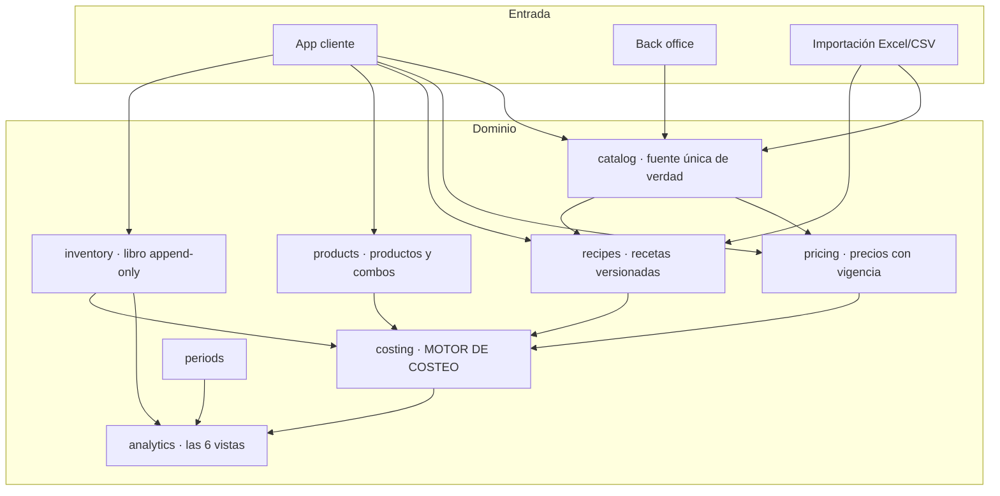
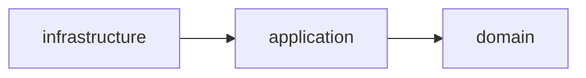
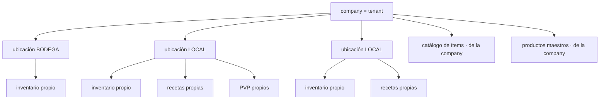
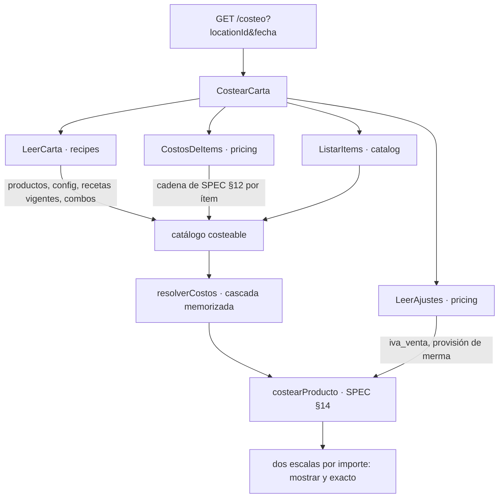
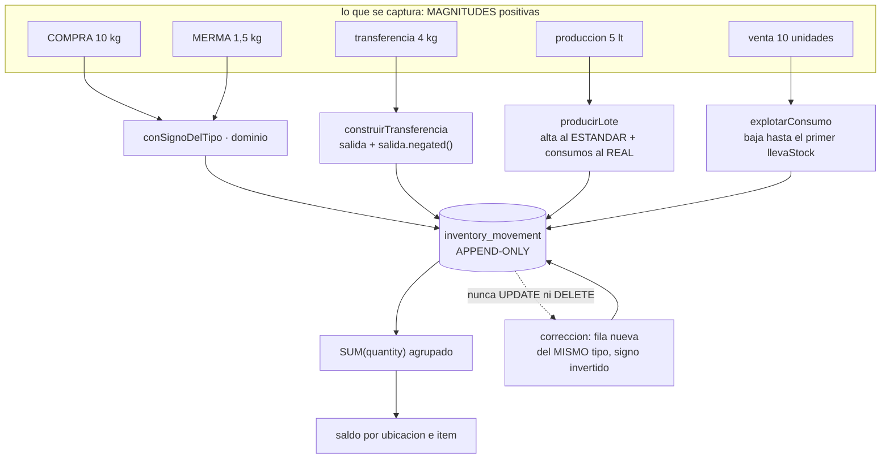
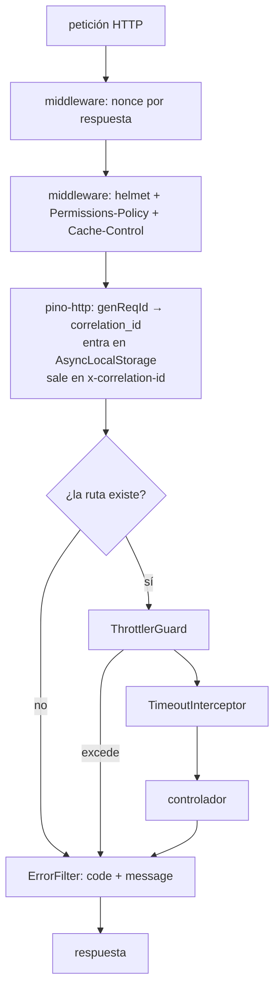
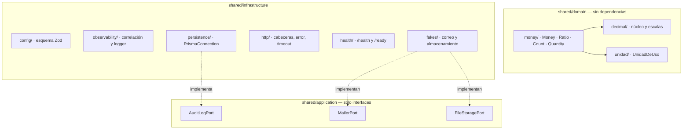

# Cómo funciona el sistema — documento maestro

> Se actualiza en cada paquete que cambie la estructura. Es el mapa que lee alguien que llega nuevo.

## Visión



## Regla de dependencia



El dominio no sabe que existe la infraestructura. El motor de costeo se ejecuta con la base de datos apagada.

## Jerarquía de datos



**El catálogo y los productos maestros viven en la company. El inventario, las recetas y los precios de venta viven en la ubicación.**

## Flujo del costo

```mermaid
graph LR
    PC[precio de compra] -->|quita IVA si recuperable| PN[precio neto]
    PN -->|divide por factor de conversión| CB[costo bruto por unidad de uso]
    CB -->|divide por rendimiento| CN[costo neto por unidad de uso]
    CN -->|cantidad × base EP| CL[costo de línea]
    CB -->|cantidad × base AP| CL
    CL -->|suma| LOTE[costo del lote]
    LOTE -->|divide por porciones| POR[costo por porción]
    POR -->|× 1 + merma no atribuible| MER[costo con merma]
    MER -->|+ empaque neto| TOT[COSTO TOTAL POR UNIDAD]
```



Las fórmulas exactas están en `docs/SPEC.md` §12 a §18.

### Cómo se alimenta el motor (desde P5)

**El motor no consulta nada.** Recibe valores y devuelve valores, y por eso las 45 pruebas que lo cubren corren con PostgreSQL apagado — que es el criterio arquitectónico de CLAUDE.md §2 aplicado al componente que lo motivaba.



**Ocho consultas, fijas.** No importa si la carta tiene 3 productos o 200: `LeerCarta` trae cuatro cosas de `recipes` en cuatro consultas y `CostosDeItems` resuelve el costo de **todos** los ítems en cuatro más. Pedir la receta de cada producto por separado serían 200 consultas antes de empezar a calcular, y el presupuesto de 400 ms de §5 no lo aguanta.

**Ninguno de los dos duplica una regla.** `CostosDeItems` llama a la misma `costoDelItem` de SPEC §12 que usa la consulta de un solo ítem, y cuál precio está vigente lo sigue decidiendo el dominio (R5), no un `DISTINCT ON`. El día que hubiera dos implementaciones, el costo de un plato dependería de por dónde se preguntó.

**Costear uno pasa por costear todos.** Pedir un solo producto carga la carta entera y se queda con uno. Es deliberado: dos rutas distintas para el mismo número son dos oportunidades de que den respuestas distintas, y en este sistema eso no se ve en pantalla.


---

## El libro de inventario (desde P6)

**No existe un campo `stock`.** El saldo de un ítem en una ubicación es la suma de sus movimientos, y nada más. Un campo mutable sería un segundo número capaz de discrepar del libro, y cuando discrepara nadie sabría cuál de los dos es el bueno.



### El signo lo pone el tipo, no quien captura

Quien registra una merma escribe «2,5 kg», no «−2,5 kg»: pedirle el signo sería pedirle que entienda la convención interna del libro, y quien no la entienda escribirá la mitad de las mermas al revés. `AJUSTE` es la única excepción, porque existe justamente para mover el saldo en la dirección que haga falta.

Que el signo concuerde con el tipo lo sostiene la base, en dos piezas que se necesitan mutuamente: un `CHECK` que cruza `direction` con el signo, y una **clave foránea compuesta `(type, direction)`** que impide que la dirección de la fila discrepe de su catálogo. Sin la segunda, declarar `('COMPRA','SALIDA')` colaría una cantidad negativa saltándose el `CHECK`.

### Corregir es escribir, nunca editar

R3 no admite matices: no hay `UPDATE` ni `DELETE` sobre el libro, en tres capas —privilegio, trigger de sentencia y `audit:forbidden`— y no existe ninguna ruta de la API que lo intente.

La corrección es una fila **del mismo tipo**, con la cantidad y el importe invertidos y **la fecha del original**. Que conserve el tipo importa más de lo que parece: `compras_del_mes` de SPEC §16 es `Σ(movimientos tipo COMPRA)`, y si la corrección fuera un `AJUSTE`, el mes cerraría contando compras que nadie hizo. **El saldo no lo detectaría** —`+10` y `−10` suman cero se llamen como se llamen—: lo detecta la agregación por tipo, y solo ella.

### El interruptor de stock decide hasta dónde baja una venta

```
llevaStock = true   la preparacion se produce en lote y ESTA en el inventario
                    -> vender consume LA PREPARACION
llevaStock = false  la preparacion no pasa por inventario
                    -> vender EXPLOTA su receta y consume los insumos
```

Descender por una preparación que sí está en el inventario descontaría dos veces lo mismo: una al producirla y otra al venderla.

### La producción guarda dos costos, y su diferencia es la señal

R10: el alta de la preparación se valora al **costo estándar** —su precio de referencia confirmado—, para que un plato no cambie de costo según cuánto se produjo ese día. El **costo real** del lote se guarda al lado, y su diferencia es la varianza.

Como el alta lleva el estándar y los consumos el real, **la suma de los importes de los movimientos `PRODUCCION` de un lote es la varianza**, con signo. No hay que reconstruirla desde ningún sitio: está en el libro.

Esto se aparta de lo que el motor de costeo hace con el mismo ítem (ADR-008: si hay receta, manda la receta), y a propósito: **el valor de un inventario no puede cambiar porque alguien edite una receta.** Razonado en ADR-009.

### Quién puede ver el saldo, y por qué no es una pregunta de permisos

```
saldo = inicial + compras − consumo
```

`BODEGA` conoce el inicial y las compras **porque las registra él**. Si además ve el saldo, despeja el consumo; y el consumo dividido entre las unidades vendidas **es** la cantidad de la receta, que es el secreto de negocio del cliente (CLAUDE.md §4.3).

Por eso `inventory.read` no se le concede, y por eso **ninguna escritura del libro devuelve el saldo resultante**: una respuesta que dijera «nuevo saldo: 12,4 kg» filtraría exactamente lo mismo que un endpoint de lectura. Las escrituras responden con un id.

Lo que `BODEGA` necesita para reponer es un semáforo `REPONER`/`OK` **sin la cantidad que lo origina**. Ese semáforo necesita el punto de reorden, que sale del consumo teórico de SPEC §18: llega en P8.

---

## El proceso de la API por dentro (desde P0)

Lo que atraviesa una petición, en orden. Las cuatro protecciones globales se registran en `AppModule`/`bootstrap.ts`, de modo que **las pruebas levantan exactamente la misma aplicación que se despliega**: una defensa cableada solo en `main.ts` no existe en los tests, y entonces el test de que existe no prueba nada.



**Las cabeceras van como middleware de plataforma y no como interceptor de Nest, a propósito.** Un interceptor solo corre para peticiones que llegan a un manejador: un 404, un 429 del limitador o un cuerpo malformado saldrían **sin cabeceras**, y son justo las respuestas de las que un atacante aprende más. Hay una prueba de integración por cabecera que lo comprueba sobre un 404.

### Composición interna



`decimal.js` solo lo ve `shared/domain/decimal/` (ADR-003). `dependency-cruiser` y `audit:forbidden` lo hacen cumplir.

### Salud del proceso

| Ruta | Qué responde | Toca la base |
|---|---|---|
| `/health` | *liveness* — ¿el proceso está vivo? | **No** |
| `/ready` | *readiness* — ¿puede atender tráfico? | Sí |

La distinción tiene coste concreto: si `/health` mirara la base, un corte de PostgreSQL haría que el orquestador **matara y reiniciara todas las réplicas**, que es lo peor que puede pasar durante un corte de base de datos. Con `/ready`, la réplica sale del balanceador y vuelve sola.
