# Cómo funciona el sistema — documento maestro

> Se actualiza en cada paquete que cambie la estructura. Es el mapa que lee alguien que llega nuevo.

## Visión

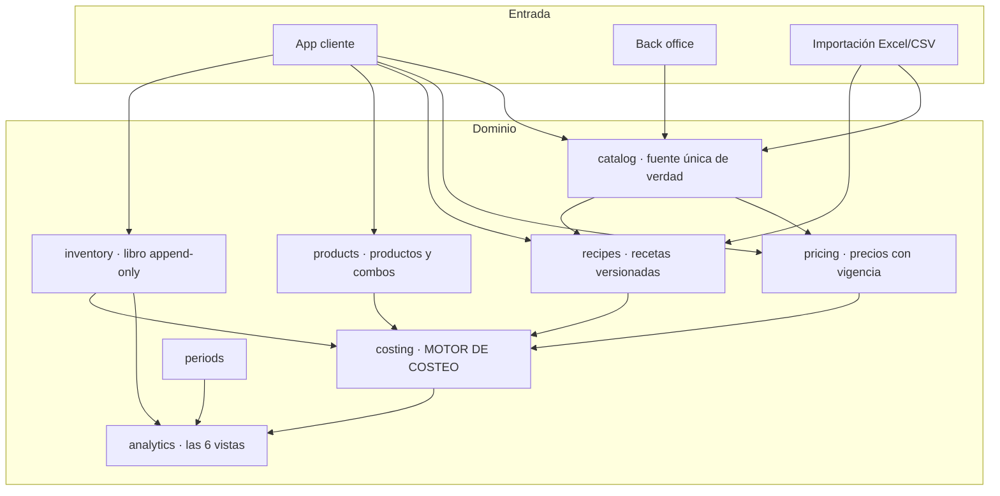

## Regla de dependencia

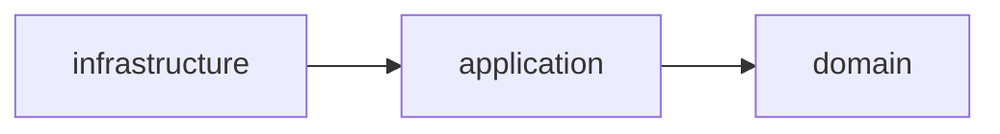

El dominio no sabe que existe la infraestructura. El motor de costeo se ejecuta con la base de datos apagada.

## Jerarquía de datos

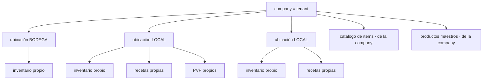

**El catálogo y los productos maestros viven en la company. El inventario, las recetas y los precios de venta viven en la ubicación.**

## Flujo del costo

```mermaid
graph LR
    PC[precio de compra] -->|quita IVA si recuperable| PN[precio neto]
    PN -->|divide por factor de conversión| CB[costo bruto por unidad de uso]
    CB -->|divide por rendimiento| CN[costo neto por unidad de uso]
    CN -->|cantidad × base EP| CL[costo de línea]
    CB -->|cantidad × base AP| CL
    CL -->|suma| LOTE[costo del lote]
    LOTE -->|divide por porciones| POR[costo por porción]
    POR -->|× 1 + merma no atribuible| MER[costo con merma]
    MER -->|+ empaque neto| TOT[COSTO TOTAL POR UNIDAD]
```

Las fórmulas exactas están en `docs/SPEC.md` §12 a §18.

### Cómo se alimenta el motor (desde P5)

**El motor no consulta nada.** Recibe valores y devuelve valores, y por eso las 45 pruebas que lo cubren corren con PostgreSQL apagado — que es el criterio arquitectónico de CLAUDE.md §2 aplicado al componente que lo motivaba.

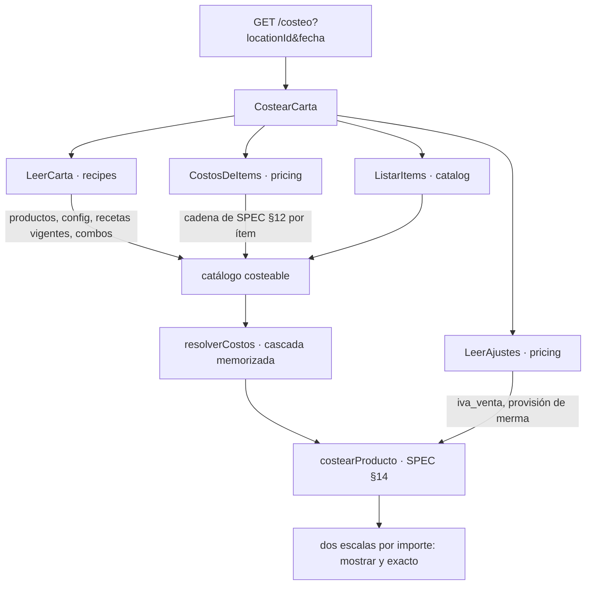

**Ocho consultas, fijas.** No importa si la carta tiene 3 productos o 200: `LeerCarta` trae cuatro cosas de `recipes` en cuatro consultas y `CostosDeItems` resuelve el costo de **todos** los ítems en cuatro más. Pedir la receta de cada producto por separado serían 200 consultas antes de empezar a calcular, y el presupuesto de 400 ms de §5 no lo aguanta.

**Ninguno de los dos duplica una regla.** `CostosDeItems` llama a la misma `costoDelItem` de SPEC §12 que usa la consulta de un solo ítem, y cuál precio está vigente lo sigue decidiendo el dominio (R5), no un `DISTINCT ON`. El día que hubiera dos implementaciones, el costo de un plato dependería de por dónde se preguntó.

**Costear uno pasa por costear todos.** Pedir un solo producto carga la carta entera y se queda con uno. Es deliberado: dos rutas distintas para el mismo número son dos oportunidades de que den respuestas distintas, y en este sistema eso no se ve en pantalla.


---

## El libro de inventario (desde P6)

**No existe un campo `stock`.** El saldo de un ítem en una ubicación es la suma de sus movimientos, y nada más. Un campo mutable sería un segundo número capaz de discrepar del libro, y cuando discrepara nadie sabría cuál de los dos es el bueno.

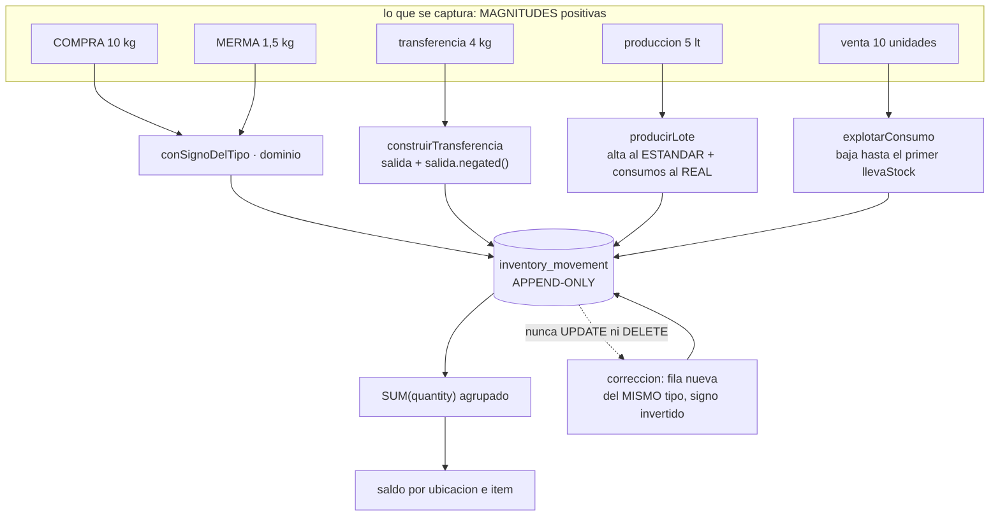

### El signo lo pone el tipo, no quien captura

Quien registra una merma escribe «2,5 kg», no «−2,5 kg»: pedirle el signo sería pedirle que entienda la convención interna del libro, y quien no la entienda escribirá la mitad de las mermas al revés. `AJUSTE` es la única excepción, porque existe justamente para mover el saldo en la dirección que haga falta.

Que el signo concuerde con el tipo lo sostiene la base, en dos piezas que se necesitan mutuamente: un `CHECK` que cruza `direction` con el signo, y una **clave foránea compuesta `(type, direction)`** que impide que la dirección de la fila discrepe de su catálogo. Sin la segunda, declarar `('COMPRA','SALIDA')` colaría una cantidad negativa saltándose el `CHECK`.

### Corregir es escribir, nunca editar

R3 no admite matices: no hay `UPDATE` ni `DELETE` sobre el libro, en tres capas —privilegio, trigger de sentencia y `audit:forbidden`— y no existe ninguna ruta de la API que lo intente.

La corrección es una fila **del mismo tipo**, con la cantidad y el importe invertidos y **la fecha del original**. Que conserve el tipo importa más de lo que parece: `compras_del_mes` de SPEC §16 es `Σ(movimientos tipo COMPRA)`, y si la corrección fuera un `AJUSTE`, el mes cerraría contando compras que nadie hizo. **El saldo no lo detectaría** —`+10` y `−10` suman cero se llamen como se llamen—: lo detecta la agregación por tipo, y solo ella.

### El interruptor de stock decide hasta dónde baja una venta

```
llevaStock = true   la preparacion se produce en lote y ESTA en el inventario
                    -> vender consume LA PREPARACION
llevaStock = false  la preparacion no pasa por inventario
                    -> vender EXPLOTA su receta y consume los insumos
```

Descender por una preparación que sí está en el inventario descontaría dos veces lo mismo: una al producirla y otra al venderla.

### La producción guarda dos costos, y su diferencia es la señal

R10: el alta de la preparación se valora al **costo estándar** —su precio de referencia confirmado—, para que un plato no cambie de costo según cuánto se produjo ese día. El **costo real** del lote se guarda al lado, y su diferencia es la varianza.

Como el alta lleva el estándar y los consumos el real, **la suma de los importes de los movimientos `PRODUCCION` de un lote es la varianza**, con signo. No hay que reconstruirla desde ningún sitio: está en el libro.

Esto se aparta de lo que el motor de costeo hace con el mismo ítem (ADR-008: si hay receta, manda la receta), y a propósito: **el valor de un inventario no puede cambiar porque alguien edite una receta.** Razonado en ADR-009.

### Quién puede ver el saldo, y por qué no es una pregunta de permisos

```
saldo = inicial + compras − consumo
```

`BODEGA` conoce el inicial y las compras **porque las registra él**. Si además ve el saldo, despeja el consumo; y el consumo dividido entre las unidades vendidas **es** la cantidad de la receta, que es el secreto de negocio del cliente (CLAUDE.md §4.3).

Por eso `inventory.read` no se le concede, y por eso **ninguna escritura del libro devuelve el saldo resultante**: una respuesta que dijera «nuevo saldo: 12,4 kg» filtraría exactamente lo mismo que un endpoint de lectura. Las escrituras responden con un id.

Lo que `BODEGA` necesita para reponer es un semáforo `REPONER`/`OK` **sin la cantidad que lo origina**. Ese semáforo necesita el punto de reorden, que sale del consumo teórico de SPEC §18: llega en P8.

---

## El mes contable y el conteo físico (desde P7)

**El Excel no tiene dimensión temporal**: todo es «del mes», un único período
implícito (SPEC §3). Esto es la extensión que hace falta para comparar un mes
con el siguiente, y para que el conteo físico congele un corte contra el que
calcular el food cost real.

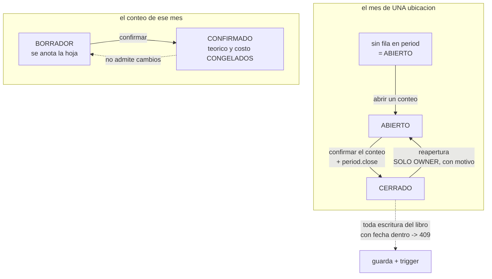

### La frontera del mes es un instante, no una fecha

`occurred_at` es `timestamptz`: un instante absoluto. Preguntar «¿de qué mes
es?» exige una zona horaria, y la respuesta cambia con ella — las 02:00 UTC del
1 de abril son las 21:00 del 31 de marzo en Guayaquil, que es **marzo**.

Por eso `period` guarda `starts_at` y `ends_at` **resueltos una sola vez**, al
abrir el período. A partir de ahí todo es una comparación de instantes: en SQL,
en el trigger y en TypeScript, sin aritmética de zonas en ninguno de los tres.

Cambiar la zona algún día no reescribe la historia: los meses ya abiertos
conservan la frontera con la que se abrieron. El intervalo es semiabierto
`[starts_at, ends_at)`, así que ningún instante cae en dos períodos ni se
escapa de todos.

> Las cinco primeras horas UTC de cada día 1 pertenecen al mes anterior en
> Ecuador. Es la trampa de **INC-013**, y aparece antes escribiendo una fecha a
> mano que operando el sistema.

### La ausencia de fila es el estado abierto

Un mes del que nadie se ha ocupado no tiene fila en `period`. Exigir que
alguien «abra» el mes antes de registrar nada dejaría a una company recién
creada sin poder anotar su primera compra, y pararía el sistema solo el día 1
de cada mes. **Cerrar es un acto explícito; bloquear el libro también.**

### Un mes cerrado no admite movimientos, y la garantía está en la base

La guarda de aplicación —`exigirLibroEscribible`, que llaman las cinco
escrituras del libro— convierte el rechazo en un `409` con un mensaje que dice
cómo seguir. **La garantía es otra cosa**: el trigger
`inventory_movement_respeta_periodo_cerrado`, que cubre toda fila que entre,
venga de donde venga, incluida la sexta escritura que alguien añada mañana sin
acordarse de llamar a nada.

Con la guarda retirada, ningún movimiento entra igualmente; lo que cambia es
que sale como **500** en vez de 409. La base garantiza, el dominio explica.

**Alcanza también a la corrección**, y es la consecuencia menos evidente: una
corrección conserva la fecha del movimiento que anula (R3), así que corregir
dentro de un mes sellado se detiene igual. Eso es lo que «cerrado es de solo
lectura» significa, y la salida es reabrir — acto del `OWNER`, con motivo, que
queda en `audit_log`.

### El conteo NO ajusta el libro

Es la decisión de la que depende que el conteo signifique algo. SPEC §18
calcula `diferencia = conteo_fisico − stock_teorico`; si al confirmar se
emitiera un `AJUSTE` por la diferencia, esa resta daría **cero siempre** y el
hallazgo desaparecería en el mismo acto de registrarlo.

```
el libro    dice lo que DEBERIA haber
el conteo   dice lo que HAY
la resta    es el hallazgo, y no se puede tener y hacer desaparecer a la vez
```

### Lo que no se contó vale lo que el libro dice, no cero

Un conteo puede ser parcial (D7). Un ítem sin línea **no genera diferencia** y
aporta **su valor teórico** al inventario final. Si valiera cero, no haber
mirado un estante equivaldría a declarar que su contenido se consumió entero, y
el consumo real se dispararía por una omisión de captura.

Lo que dice cuánto fiarse es la **cobertura**:

```
cobertura = valor verificado / valor total
```

Se mide sobre el **valor**, no sobre el número de ítems: contar cuarenta ítems
baratos y dejar el jamón sin contar es una cobertura mala aunque sean 40 de 41.
Y **viaja siempre pegada** a los números que dependen de ella — un consumo real
calculado sobre el 12 % del valor es una estimación, no un consumo real.

### Confirmar congela, y por eso la conciliación de un mes cerrado es una lectura

Al confirmar se guardan en cada línea el stock teórico y el costo de uso, y en
la cabecera los tres valores agregados. El costo sale de precios **con
vigencia** (R5): un precio nuevo con fecha retroactiva cambiaría el valor de un
inventario que ya se informó.

Es la misma razón por la que P6 congela el costo estándar de una producción:
**el valor de un inventario no puede cambiar porque alguien toque una tabla de
precios.** El efecto colateral es que P8 no tiene que recalcular nada para el
inventario valorizado de un mes cerrado.

### Quién cuenta y quién concilia

`BODEGA` cuenta y **no** concilia. La conciliación lleva stock teórico,
diferencia y valorización: tres de los datos prohibidos de CLAUDE.md §4.3, y
desde el stock teórico se despeja el consumo y desde el consumo la receta.

Es la misma asimetría que P6 instaló sobre el saldo, con la misma consecuencia:
**ninguna escritura devuelve lo que acaba de calcular.** Confirmar un conteo
calcula la conciliación entera y responde `204` sin cuerpo.

**Y el efecto colateral es el que SPEC §4 pide expresamente:** `BODEGA` cuenta a
ciegas, sin saber cuánto debería haber. Quien conoce el número esperado tiende a
ajustar el conteo hacia él, así que la restricción de confidencialidad **mejora
la calidad del dato de inventario**. Para que sea ciego de verdad, la hoja lista
todos los ítems almacenables: si trajera solo los que el libro conoce, la
presencia de una fila ya diría algo.

### Tres números que se parecen y no son el mismo

Conviene tenerlos separados por nombre, porque P8 los va a usar los tres:

| | |
|---|---|
| **saldo del libro** | `SUM(quantity)` sobre `inventory_movement`. Lo de P6 |
| **stock teórico del corte** | El saldo del libro **hasta `cutoff_at`** del conteo |
| **inventario físico** | Lo contado donde se contó, **lo teórico donde no** |


## Las seis vistas (desde P8)

**No hay un segundo motor de cálculo.** Las vistas piden la carta costeada a
`costing`, los agregados y el conteo a `inventory`, el mes a `periods` y los
parámetros a `pricing`, y componen. El día que una fórmula de costeo cambie,
cambia en un sitio.

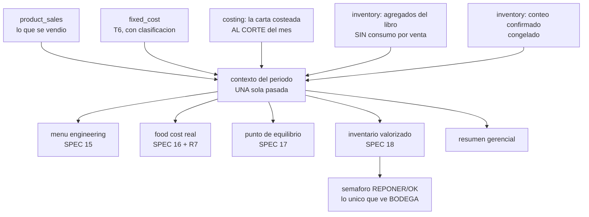

### R7 es lo que hace fiable a las otras cinco

```
costo_ventas_teorico  = consumo_teorico + empaque + provision
costo_ventas_v_costeo = venta_neta - margen_de_contribucion
DIFERENCIA = ROUND(teorico - v_costeo, 2)   ->  tiene que dar 0
```

Son **dos caminos al mismo costo de ventas**: uno pasa por la explosión de la
receta, el otro por el margen de cada plato. Si el motor está sano coinciden.

**Lo que R7 detecta es un componente que se cuenta en un lado y no en el otro**,
y en P8 detectó uno que llevaba dos paquetes en el código: la receta es del
**lote** y la venta es de **porciones**, así que vender 100 unidades de un
producto que rinde 2 consume 50 lotes y no 100. Con rendimiento 1 los dos
caminos coinciden aunque el consumo esté mal — por eso las 596 pruebas de
P0–P6 no lo vieron.

**Lo que R7 NO detecta** es un número de entrada equivocado: si el consumo
teórico está mal en los dos lados, la diferencia sigue dando cero. Hay una
prueba unitaria que lo enseña. La defensa contra eso son los casos conocidos,
cuyos valores salen del Excel y no del código.

### Tres traducciones del Excel que producen números plausibles si se hacen mal

| | El Excel | Aquí |
|---|---|---|
| **El signo** | Las mermas se capturan en positivo y se **restan** | El libro lleva el signo dentro, así que se **suman** |
| **El consumo** | No hay movimientos de consumo: se calcula | Puede haberlos (P6), así que se **excluyen** del agregado o se contaría dos veces |
| **La receta** | Es del lote, y el costo se divide por las porciones | El consumo también se **divide**: 100 unidades de un producto que rinde 2 son 50 lotes |

Las tres dan cifras creíbles si se equivocan. La tercera la cazó R7; las otras
dos tienen su propia prueba, y la del consumo es un **invariante**: el stock
teórico da lo mismo esté o no registrado el consumo por venta en el libro.

### Quién ve qué, por tercera vez

`BODEGA` no recibe **ninguna** de las seis vistas. Todas llevan consumo
teórico, stock teórico, diferencias o costos: cuatro de los seis datos
prohibidos de CLAUDE.md §4.3, y desde cualquiera de ellos se despeja la receta.

```
P6   escribe el libro       y NO lee el saldo
P7   cuenta el inventario   y NO ve la conciliacion
P8   recibe el semaforo     y NO ve ninguna vista
```

Lo que sí le corresponde —SPEC §4 lo dice con estas palabras— es un semáforo
`REPONER`/`OK` **sin la cantidad que lo origina**, servido desde su propio caso
de uso y con su propio tipo.


## La importación de catálogo (desde P10)

**No es un autoservicio: es una migración operada.** No hay pantalla de subida ni confirmación en dos
pasos. Un operador ejecuta `npm run importar` con el archivo delante, mira el informe y decide.

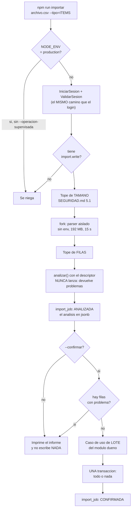

### Quién escribe qué

**`imports` no escribe ni una fila de negocio.** Traduce celdas y delega en el módulo dueño, que
valida con sus propias reglas — un ítem importado tiene que ser indistinguible de uno creado a mano.
Lo hace cumplir la regla `tablas-de-catalogo-solo-en-catalog` de `audit:forbidden`, que nombra a
`imports` explícitamente.

| Tipo | Módulo dueño | Caso de uso |
|---|---|---|
| `ITEMS` | `catalog` | `CrearItemsEnLote` — crea también los grupos que falten |
| `ARTICULOS` | `catalog` | `CrearArticulosEnLote` — el factor lo calcula el dominio |
| `PRECIOS` | `pricing` | `SugerirPreciosEnLote` — nacen sugeridos (R5) |
| `PRODUCTOS` | `recipes` | `CrearProductosEnLote` — producto + PVP + empaque |
| `RECETAS` | `recipes` | `GuardarRecetasEnLote` — **recetas y componentes de combo** |
| `MOVIMIENTOS` | `inventory` | `RegistrarMovimientosEnLote` |

### Lo que hace que «todo o nada» sea cierto, y hasta dónde llega

Cada caso de uso de lote abre **un solo `TenantTransaction.run()`** y escribe dentro. Antes de eso, el
dominio valida el lote **entero** y devuelve todos los problemas con su posición — no el primero,
porque quien migra un catálogo arregla el archivo de una pasada.

**El límite, dicho en voz alta:** la atomicidad es **por pasada**, no entre módulos.
`ClienteDeTransaccion` no expone `$transaction`, así que una transacción no puede contener a otra.
Importar ítems y luego precios son dos transacciones. Lo compensa el orden —validar todo antes de
escribir nada—, y lo que queda expuesto es un fallo de infraestructura entre pasadas.

### Cómo se distingue una receta de un combo

**Por el tipo del producto destino, no por una columna.** SPEC §8: un `SIMPLE` consume ítems, un
`COMBO` consume productos simples ya costeados. Una línea cuyo destino es un combo se escribe en
`combo_component`; si fuera a `recipe_line`, se le volvería a aplicar el rendimiento y la provisión de
merma, que es lo que R12 prohíbe (ADR-008 §14).

Un combo no puede contener otro combo: es lo que «componentes que son productos simples» significa, y
es lo que hace innecesario validar ciclos ahí.

---

## El proceso de la API por dentro (desde P0)

Lo que atraviesa una petición, en orden. Las cuatro protecciones globales se registran en `AppModule`/`bootstrap.ts`, de modo que **las pruebas levantan exactamente la misma aplicación que se despliega**: una defensa cableada solo en `main.ts` no existe en los tests, y entonces el test de que existe no prueba nada.

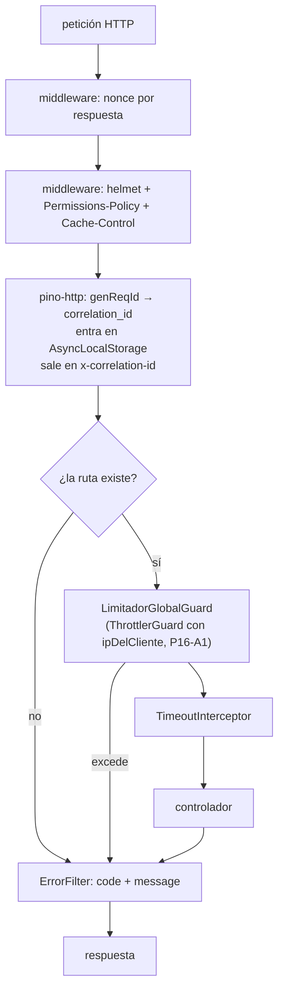

**Las cabeceras van como middleware de plataforma y no como interceptor de Nest, a propósito.** Un interceptor solo corre para peticiones que llegan a un manejador: un 404, un 429 del limitador o un cuerpo malformado saldrían **sin cabeceras**, y son justo las respuestas de las que un atacante aprende más. Hay una prueba de integración por cabecera que lo comprueba sobre un 404.

### Composición interna

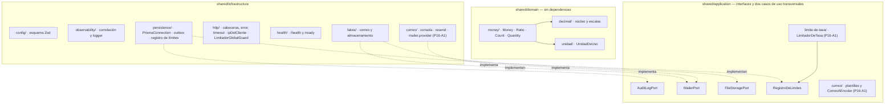

`decimal.js` solo lo ve `shared/domain/decimal/` (ADR-003). `dependency-cruiser` y `audit:forbidden` lo hacen cumplir.

### Salud del proceso

| Ruta | Qué responde | Toca la base |
|---|---|---|
| `/health` | *liveness* — ¿el proceso está vivo? | **No** |
| `/ready` | *readiness* — ¿puede atender tráfico? | Sí |

La distinción tiene coste concreto: si `/health` mirara la base, un corte de PostgreSQL haría que el orquestador **matara y reiniciara todas las réplicas**, que es lo peor que puede pasar durante un corte de base de datos. Con `/ready`, la réplica sale del balanceador y vuelve sola.

---

## La capa visual de la aplicación cliente (desde P14)

`apps/web` viste la identidad de `docs/Manual de Marca/platise-brand-book.pdf`.
El detalle de las decisiones está en **ADR-019**; aquí va cómo está montado y
qué se puede tocar sin romper nada.

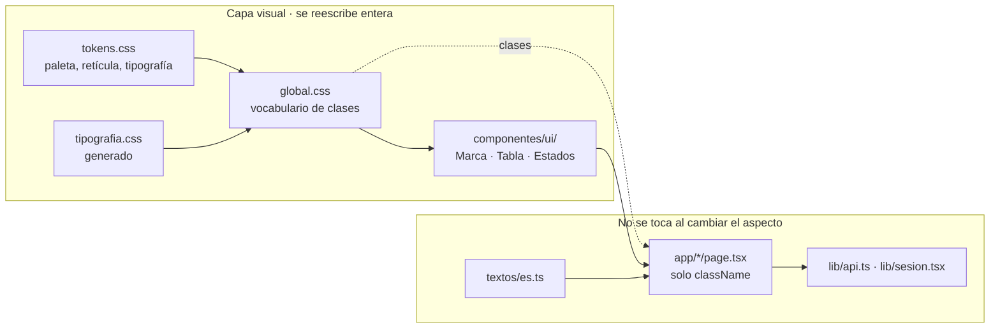

### Dónde vive cada cosa

| Capa | Archivo | Se reemplaza |
|---|---|---|
| Tokens | `src/styles/tokens.css` | ✅ entero |
| Tipografía | `src/styles/tipografia.css` (**generado**) + `public/fuentes/` | ✅ entero |
| Apariencia | `src/styles/global.css` | ✅ entero |
| Componentes de UI | `src/componentes/ui/` | ✅ entero |
| Marca | `public/marca/{isotipo,logotipo}.svg` | ✅ entero |
| Pantallas | `src/app/*/page.tsx` | ⚠️ solo sus `className` |
| Hooks y servicios | `src/lib/` | ❌ no se toca |

**La prueba de que la separación es real:** `global.css` se puede reescribir
entero sin abrir una sola página. No queda ni un `style={{…}}` ni un `var(--…)`
dentro de un componente — antes de P14 había 107 bloques repartidos.

### Las tres reglas que no se pueden romper al cambiar el aspecto

1. **El panel operativo va en claro, sin vidrio y sin sombra.** No es
   preferencia: el manual (p. 30) lo decide por el reflejo de una cocina, y
   prohíbe el vidrio detrás de una tabla densa porque baja el contraste del
   texto pequeño. Por eso no hay `prefers-color-scheme`.
2. **Persimmon vivo (`#C4552F`) no es color de texto.** Reprueba con 3,93:1 y el
   manual lo declara «la regla, no el error». Se usa como señal —la cinta al
   costado de una fila— y su variante profunda (`#A8391A`, 5,64:1) para texto.
3. **El tramo menor de la «regla rota» es siempre Persimmon.** Si el naranja
   queda a la izquierda, se invirtió el significado: el tramo mayor son los
   costos y el menor es el margen. El manual lo lista como pieza mal generada.

### Cómo se regenera lo generado

`tipografia.css` y los dos `.svg` de la marca no se escriben a mano. Salen del
PDF del manual con los guiones que quedaron descritos en
`docs/pasos/P14/CONSTRUCCION.md`. **Si el manual cambia de versión, se vuelven a
extraer de ahí**, y la comprobación de que la extracción es correcta es
recalcular los seis ratios de contraste que el manual publica: si un hex se leyó
mal, alguno no cuadra.

### Qué NO cubre ninguna prueba automatizada

El aspecto. Lo que hay es medición con navegador —Chrome sin cabeza, capturas y
`scrollWidth` contra `clientWidth`—, y es lo que encontró los dos fallos reales
de P14: la barra partida en dos filas y un desbordamiento que resultó no existir.

---

## El correo transaccional y el restablecimiento de contraseña (desde P16-A1)

**La API no envía correo. Encola.** Toda escritura que anuncia algo por correo —invitar, reenviar,
pedir un restablecimiento, el aviso de bloqueo del login— deja su fila en `email_outbox` **dentro
de la misma transacción** que crea lo anunciado. Quien entrega es un **tercer proceso**, el
despachador (`apps/api/src/despachador.ts`, servicio `correo` en compose), con su propio rol
`costeo_despachador`, que ve exactamente dos tablas y ninguna otra (ADR-025).

```mermaid
sequenceDiagram
    participant A as ADMIN (navegador)
    participant API as API (costeo_app)
    participant DB as PostgreSQL
    participant D as Despachador (costeo_despachador)
    participant R as Resend
    participant B as Buzon del invitado

    A->>API: POST /usuarios (email)
    API->>DB: golpear(usuario.invitar, ip) y golpear(usuario.invitar, correo:sha256) - una transaccion por clave
    API->>DB: BEGIN - set_config(company) - INSERT app_user INVITED - INSERT email_outbox PENDIENTE - COMMIT
    API-->>A: 202, siempre (no dice si el correo ya existia)

    loop cada CORREO_INTERVALO_MS (5 s)
        D->>DB: SELECT ... FOR UPDATE SKIP LOCKED LIMIT lote, y reserva de 5 min en la misma transaccion
        D->>DB: renovarReserva(fila) con la firma de la pasada (0 filas: se cede)
        D->>R: POST /emails (from, to, subject, text), timeout 10 s
        alt 2xx
            R-->>D: aceptado
            D->>DB: UPDATE ENVIADO, sent_at, datos = plantilla + destinatario
        else error o timeout
            R-->>D: 4xx, 5xx o nada
            D->>DB: UPDATE intentos + 1, error, siguiente_intento_en (1, 2, 4, 8 min); FALLIDO al quinto con datos saneado
        end
        D->>DB: DELETE FROM rate_limit_hit WHERE at < ahora - 24 h
        D->>D: latido en CORREO_LATIDO (el healthcheck del contenedor)
    end

    R->>B: correo con APP_URL/activacion?token=... y su caducidad
```

Lo que el diagrama no enseña y conviene saber:

- **`datos` lleva el enlace con el token en claro mientras el correo está en vuelo, y solo el
  despachador puede leerlo.** `costeo_app` y `costeo_backoffice` tienen `SELECT` por columnas,
  todas menos esa. Al cerrar el correo, `datos` pasa a ser `{plantilla, destinatario}`.
- **`SKIP LOCKED` no basta solo.** El bloqueo de fila muere al confirmar y el envío ocurre fuera:
  por eso la pasada **reserva** las filas cinco minutos (`siguiente_intento_en`) y renueva la
  reserva fila a fila. Dos despachadores a la vez —el contenedor viejo y el nuevo en un
  redespliegue— no mandan el mismo correo dos veces. La única ventana que queda son los
  milisegundos entre el `2xx` y el `UPDATE`, y está dicha en ADR-025.
- **Un fallo de envío no para la pasada; un fallo al marcar sí.** El primero se anota y el
  siguiente correo se intenta. El segundo sube sin tocar la fila: un correo que el proveedor
  aceptó no debe quedar `PENDIENTE` con un error de base en la columna que leen la aplicación y el
  back office.
- **`SIGTERM` termina la pasada en curso y después cierra el pool.** Sin `enableShutdownHooks()`
  de Nest, que haría lo contrario; una regla de `audit:forbidden` lo vigila.
- **El back office ve la salud, no el contenido**: `GET /correo/salud` devuelve
  `{pendientesAntiguos, fallidos, ultimoEnvio}` y nada más.

### El restablecimiento de contraseña ocurre sin sesión, y por eso pasa por dos funciones definer

Quien olvidó su contraseña no puede entrar, así que no hay tenant que fijar. Las dos escrituras van
por `password_reset_request` y `password_reset_consume` —las únicas dos funciones `SECURITY
DEFINER` que escriben—, y todo lo demás lo hace la aplicación por su camino normal, bajo el
`company_id` que la segunda devuelve.

```mermaid
sequenceDiagram
    participant U as Persona sin sesion
    participant API as API (costeo_app)
    participant DB as PostgreSQL (definer como costeo_migrator)
    participant D as Despachador

    U->>API: POST /auth/password/olvido (email)
    API->>DB: golpear(password.olvido, ip:...) y golpear(password.olvido, correo:sha256)
    API->>API: token de 256 bits, SHA-256, expires_at = ahora + HORAS_DE_RESTABLECIMIENTO
    API->>DB: SELECT password_reset_request(email, hash, expires_at, datos)
    Note over DB: con usuario ACTIVE: INSERT password_reset_token + INSERT email_outbox (company_id del usuario)<br/>sin usuario: nada, y devuelve igual
    API->>DB: audit_log auth.password.reset_requested (ANONYMOUS, con IP, sin company, sin el correo)
    API-->>U: 202 con cuerpo vacio, exista o no el correo
    D-->>U: correo con APP_URL/restablecer?token=... (caduca en 1 h)

    U->>API: POST /auth/password/restablecimiento (token, contrasena)
    API->>DB: golpear(password.restablecimiento, ip:...)
    API->>DB: SELECT user_id, company_id FROM password_reset_consume(hash, ahora)
    Note over DB: UPDATE used_at si no estaba usado ni caducado y el usuario sigue ACTIVE; si no, ninguna fila
    API->>DB: run(company_id): leer el correo, politica de contrasenas, Argon2id, revocar TODAS las sesiones, audit auth.password.reset_completed
    API-->>U: 204 (o 400 ENTRADA_INVALIDA con el mismo mensaje para token vacio, inexistente, usado o caducado)
```

Tres cosas que son la decisión entera:

- **La respuesta de `/olvido` es la misma exista o no el correo**, y el trabajo en Node también.
  Lo que difiere es lo que la base hace por dentro (dos `INSERT` con usuario, ninguno sin él): un
  residuo de milisegundos que se reconoce, se acota con el límite de tasa —diez muestras por hora
  no dan para medirlo— y se mide con una prueba de medianas.
- **El token se gasta antes de mirar la contraseña.** Una contraseña débil obliga a pedir otro
  enlace; la alternativa dejaba vivo un token contra el que ya se falló.
- **Restablecer revoca todas las sesiones** (SEGURIDAD.md §2.2), incluida la que alguien pudiera
  tener abierta con la contraseña vieja.

### Lo que cuenta por IP cuenta por la IP del cliente, no por la del proxy

Desde P14b hay un proxy delante (Caddy), y hasta P16-A1 la API tomaba `socket.remoteAddress`:
la IP de Caddy, para todos. `ipDelCliente` (`shared/infrastructure/http/`) es el único camino y
cree el último salto de `X-Forwarded-For` solo si el socket está en `PROXY_DE_CONFIANZA`. Lo usan
el login, el back office, el limitador global de 300/min y el límite de tasa de las cuatro rutas
(ADR-026, INC-022).

---

## El armazón de la aplicación cliente (desde P16 · Armazón)

Todo lo autenticado de `apps/web` cuelga de un grupo de rutas; lo público queda fuera. Las decisiones
están en **ADR-020** (el armazón) y **ADR-022** (cómo leen y escriben las pantallas).

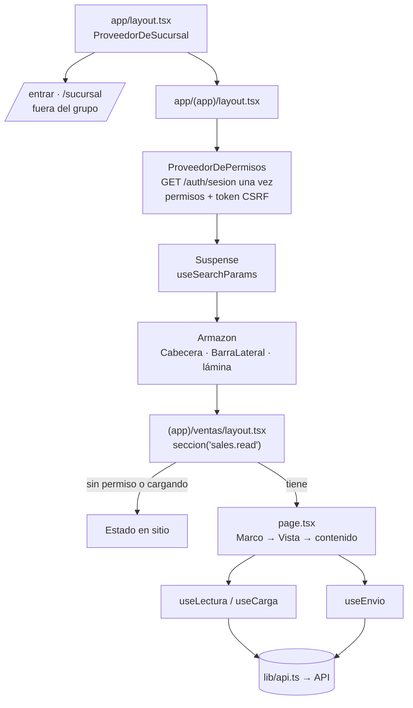

- **Los permisos no se deducen del rol** y empiezan cerrados: mientras `GET /auth/sesion` no ha
  contestado, `tiene()` dice que no y ninguna sección lanza su lectura.
- **El mes es `?anio&mes`**, por defecto el de `America/Guayaquil`. La cabecera solo enseña el
  selector en las secciones que lo tienen (`conMes` en `navegacion.ts`) y la barra lateral lo lleva en
  sus enlaces.
- **Una lectura enseña solo su propio resultado**: si la sucursal o el mes cambian, vuelve a
  «cargando» en el mismo render, y la respuesta vieja se descarta al llegar.
- **Si la sesión se cae**, cualquier respuesta `SESION_INVALIDA` manda a `/entrar` desde un solo sitio
  (`useEntrarAlCaducar`), registrado por el armazón y por `/sucursal`.
- **Sin sesión, las mutaciones salen sin `X-CSRF-Token`** y decide la API: el login, la activación, el
  olvido y el restablecimiento funcionan; una ruta protegida contesta `SESION_INVALIDA`. Hasta el
  armazón, el cliente pedía el token también sin sesión y **el login no llegaba a salir** (INC-023).

---

## La sesión y el token anti-CSRF (desde P16-A2)

Hasta P16-A2 la única defensa contra CSRF era el atributo `SameSite=Strict` de la cookie de sesión.
Lo aplica el **navegador**, no la API; mira el **sitio** y no el **origen**; y la API no tiene forma
de saber si se aplicó. Desde P16-A2 hay además un **token por sesión** que comprueba el servidor
(U4, **ADR-021**), y los tres guards globales corren en un orden que no es estético: **sesión → CSRF
→ permisos**. Sin sesión no hay token con el que comparar, y comprobar permisos de una petición que
ni siquiera originó el usuario sería autorizar un ataque antes de rechazarlo.

```mermaid
sequenceDiagram
    participant P as Pagina (apps/web)
    participant API as API (costeo_app)
    participant DB as PostgreSQL

    Note over P,DB: 1. Entrar - nacen los DOS tokens de la misma sesion
    P->>API: POST /auth/login {email, contrasena}   (solo application/json)
    API->>API: GeneradorDeTokens x2 - sesion y csrf, 32 bytes cada uno, NO derivados
    API->>DB: INSERT session (token_hash = SHA256(sesion), csrf_token EN CLARO)
    API-->>P: 200 {expiraEn, csrf} + Set-Cookie: sesion=... (HttpOnly, SameSite=Strict)
    Note over P: guardarCsrf() - en memoria, nunca en localStorage ni en una cookie

    Note over P,DB: 2. Mutar - la cabecera es lo que un sitio cruzado no puede poner
    P->>API: POST /conteos  Cookie: sesion=...  X-CSRF-Token: el token
    API->>DB: session_lookup(SHA256(cookie)) - devuelve permisos, alcance y csrf_token
    Note over API: SesionGuard deja la sesion en el WeakMap de la peticion
    alt csrf_token es NULL (sesion anterior a la migracion)
        API-->>P: 401 SESION_INVALIDA - media sesion no es una sesion
    else falta la cabecera o no coincide
        API->>API: CsrfGuard - timingSafeEqual(SHA256(esperado), SHA256(recibido))
        API-->>P: 403 CSRF_INVALIDO (el motivo ausente/no_coincide se queda en el log)
    else coincide
        API->>API: PermisosGuard - la capacidad que el endpoint declara
        API->>DB: TenantTransaction.run(companyId) - la escritura
        API-->>P: 201
    end

    Note over P,DB: 3. Recargar - el token se recupera, no se rota
    P->>API: GET /auth/sesion   Cookie: sesion=...   (lectura: sin cabecera)
    API-->>P: 200 {userId, permisos, alcance, csrf} - el MISMO token, sin companyId

    Note over P,DB: 4. Dos pestanas, sin atacante - el reintento unico
    P->>API: POST /ventas con un token que dejo de valer
    API-->>P: 403 CSRF_INVALIDO
    P->>API: GET /auth/sesion - tira el de memoria y pide el vigente
    P->>API: POST /ventas otra vez (UNA sola vez; si vuelve a fallar, el error sube)
```

Lo que el diagrama no enseña y decide el diseño:

- **El token se guarda en claro, y el de sesión no.** No es una credencial de acceso: quien tenga la
  columna no puede entrar, porque la credencial es la cookie, de la que la base guarda solo el
  SHA-256. Y quien ya tenga la cookie **no necesita** el token: está actuando *como* la víctima, no
  *contra* ella. Guardarlo hasheado, además, haría imposible el paso 3.
- **La comparación se hace sobre los SHA-256 de los dos lados.** `timingSafeEqual` lanza con
  longitudes distintas, así que comparar los tokens crudos obligaría a mirar la longitud primero —y
  esa comprobación instantánea es un oráculo del tamaño del token bueno—. Hasheando, siempre son 32
  bytes. El hash aquí no guarda nada: iguala longitudes.
- **Cero consultas nuevas.** El token viaja en `session_lookup`, que ya corría en cada petición, y
  sale de la misma fila. `GET /auth/sesion` no consulta nada: devuelve lo que el guard dejó en el
  `WeakMap`.
- **Las cuatro rutas públicas quedan fuera del guard, y el login por una razón distinta a las otras
  tres.** En activación, olvido y restablecimiento no hay sesión que suplantar. En el login sí había
  algo: una petición cruzada no *usa* una credencial, la **crea** —*login CSRF* / fijación—, y
  `SameSite` gobierna el envío de la cookie, no su almacenamiento. Lo que lo cierra es que la API
  **analiza solo `application/json`** (`bootstrap.ts`: `bodyParser: false` + `useBodyParser('json')`),
  que es justo lo que un `<form>` cruzado no puede emitir. `POST /auth/logout` **no** queda fuera.
- **El back office lleva el suyo**, en su proceso, su tabla y su guard; lo único que comparten los
  dos es la comparación en tiempo constante, que vive una sola vez en `shared/infrastructure/http/csrf.ts`.
- **`Origin`/`Referer` no se comprueba** (D-16.69): duplicaría la lista blanca de CORS, que en
  desarrollo y en las pruebas está vacía, y la comprobación necesitaría un «si está vacía, pasa» que
  falla abierto. La señal para reabrirlo está en ADR-021.

---

## La concurrencia optimista (desde P16-B)

Las pantallas editan con **reemplazos totales**, y dos personas con la misma ficha abierta se pisaban
sin enterarse: ganaba la última en guardar. Desde P16-B cada escritura de reemplazo lleva **lo que se
leyó**, y si otro escribió entre medias recibe **409 `CONFLICTO_DE_VERSION`** (D-16.11, **ADR-023**).
Hay dos testigos, porque hay dos formas de escribir: sobre una fila (producto, ítem) o creando una
fila nueva (receta).

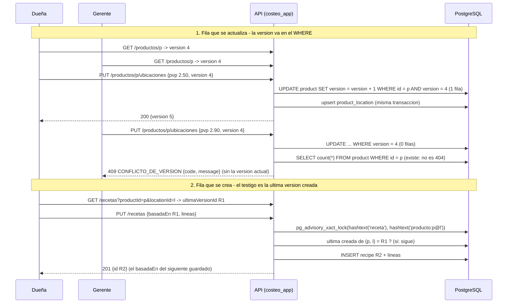

Lo que el diagrama no enseña y decide el diseño:

- **Por qué la condición va dentro del `UPDATE` y no en un `if` antes.** Leer «4», comparar en
  JavaScript y escribir deja una ventana en la que dos peticiones leen «4» y escriben las dos. Dentro
  del `UPDATE`, la segunda espera el bloqueo de la fila y, en `READ COMMITTED`, **vuelve a evaluar su
  `WHERE`** contra la fila ya escrita: cero filas. La 🔴 que lo prueba no usa `Promise.all` —en local no
  se solapan— sino una fila bloqueada desde otra conexión; con un `if` previo da cinco 200 en vez de uno.
- **Por qué la receta necesita un candado y el producto no.** La carrera de la receta no escribe sobre
  una fila existente: **inserta** otra, así que no hay fila que bloquear. El candado consultivo
  serializa a los dos guardados sin depender de qué filas existan, y muere con la transacción.
- **La versión del producto es del agregado.** Sube con el empaque, con los componentes y con la
  configuración de **cualquier** ubicación: fijar el PVP del local A deja obsoleto el formulario del
  local B. Es la deuda aceptada de D-16.20, con su señal en ADR-023. La receta no la tiene: su testigo
  es por destino **y ubicación**.
- **Lo que sobrescribe por definición no lleva testigo, pero pasa por el candado.** Propagar y revertir
  (R11 ya obligó a previsualizar) y las cargas en lote (no hay formulario que haya leído nada) escriben
  sin comprobar; como crean versiones nuevas o suben la del combo, un formulario abierto se entera con
  un 409 en vez de pisarlas.
- **El 409 no trae el número.** Con él dentro, lo fácil sería reenviar con él —pisar al otro con un paso
  más—. Lo que el cliente necesita es releer el estado entero.
- **La carga del mes también (desde P16-C).** Las unidades vendidas y los costos fijos se guardan por
  reemplazo, y comparten el testigo `period.version` (D-16.121): la condición va en el `WHERE` del
  `UPDATE period` y en la misma transacción que borra y reescribe las filas. La suben solo esas dos
  cargas —ni un movimiento, ni el cierre, ni la reapertura—, y un mes sin fila se lee con `1`, la versión
  que tendrá al crearse.
