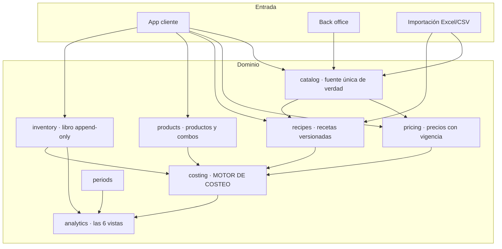
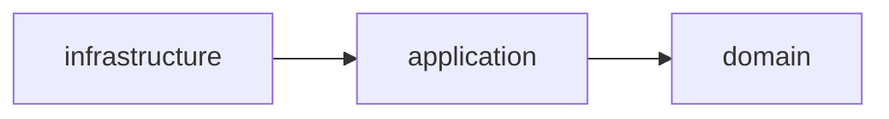
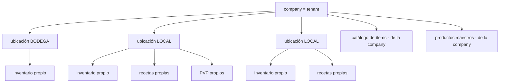
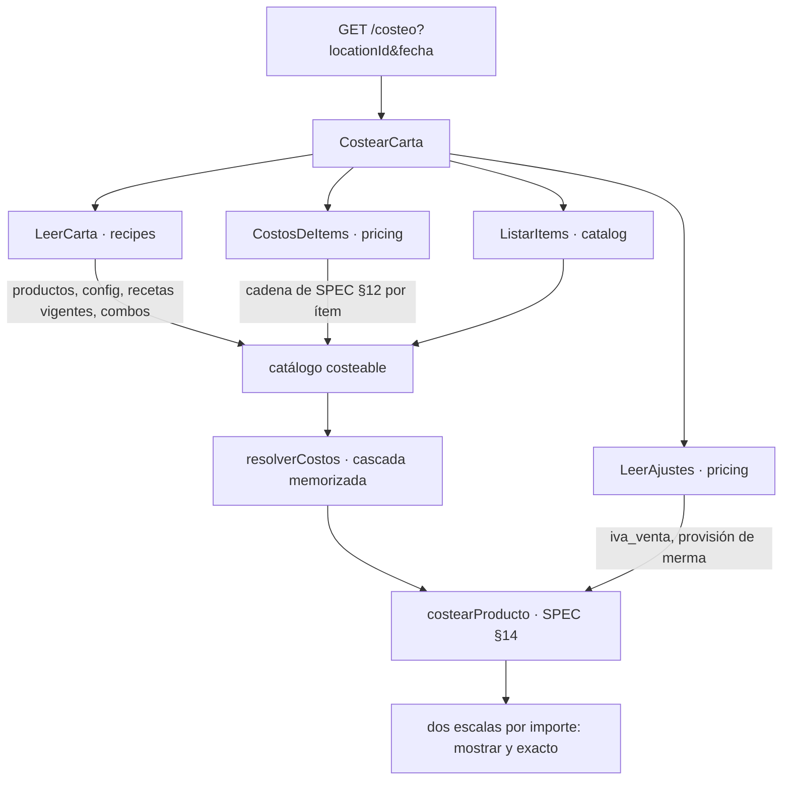
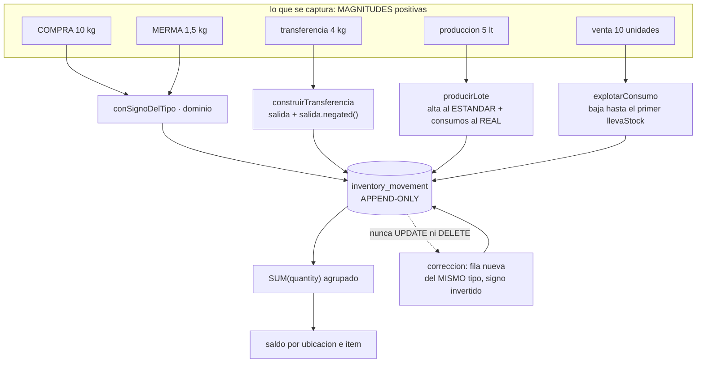
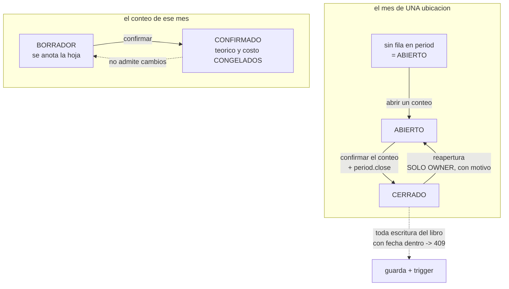
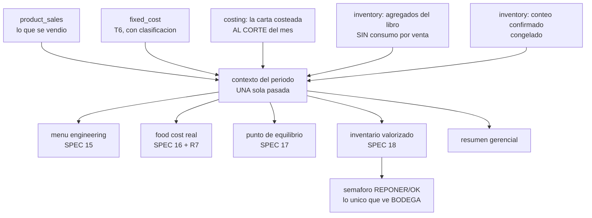
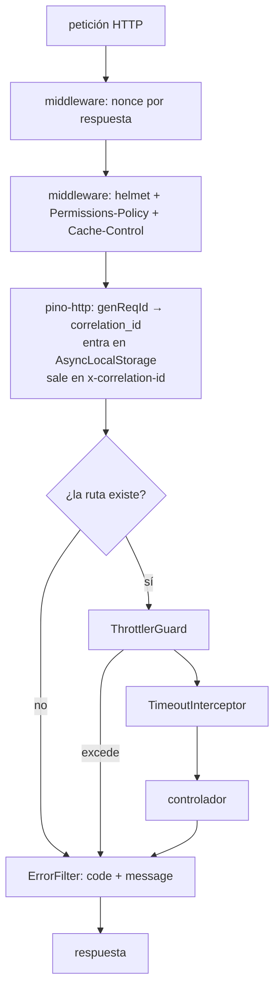
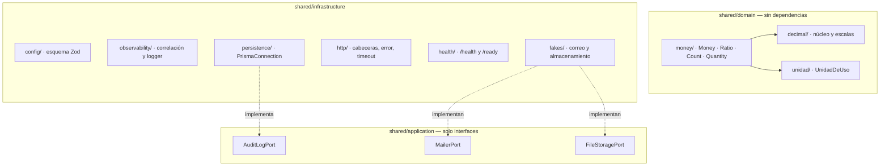

# Cómo funciona el sistema — documento maestro

> Se actualiza en cada paquete que cambie la estructura. Es el mapa que lee alguien que llega nuevo.

## Visión



## Regla de dependencia



El dominio no sabe que existe la infraestructura. El motor de costeo se ejecuta con la base de datos apagada.

## Jerarquía de datos



**El catálogo y los productos maestros viven en la company. El inventario, las recetas y los precios de venta viven en la ubicación.**

## Flujo del costo

```mermaid
graph LR
    PC[precio de compra] -->|quita IVA si recuperable| PN[precio neto]
    PN -->|divide por factor de conversión| CB[costo bruto por unidad de uso]
    CB -->|divide por rendimiento| CN[costo neto por unidad de uso]
    CN -->|cantidad × base EP| CL[costo de línea]
    CB -->|cantidad × base AP| CL
    CL -->|suma| LOTE[costo del lote]
    LOTE -->|divide por porciones| POR[costo por porción]
    POR -->|× 1 + merma no atribuible| MER[costo con merma]
    MER -->|+ empaque neto| TOT[COSTO TOTAL POR UNIDAD]
```



Las fórmulas exactas están en `docs/SPEC.md` §12 a §18.

### Cómo se alimenta el motor (desde P5)

**El motor no consulta nada.** Recibe valores y devuelve valores, y por eso las 45 pruebas que lo cubren corren con PostgreSQL apagado — que es el criterio arquitectónico de CLAUDE.md §2 aplicado al componente que lo motivaba.



**Ocho consultas, fijas.** No importa si la carta tiene 3 productos o 200: `LeerCarta` trae cuatro cosas de `recipes` en cuatro consultas y `CostosDeItems` resuelve el costo de **todos** los ítems en cuatro más. Pedir la receta de cada producto por separado serían 200 consultas antes de empezar a calcular, y el presupuesto de 400 ms de §5 no lo aguanta.

**Ninguno de los dos duplica una regla.** `CostosDeItems` llama a la misma `costoDelItem` de SPEC §12 que usa la consulta de un solo ítem, y cuál precio está vigente lo sigue decidiendo el dominio (R5), no un `DISTINCT ON`. El día que hubiera dos implementaciones, el costo de un plato dependería de por dónde se preguntó.

**Costear uno pasa por costear todos.** Pedir un solo producto carga la carta entera y se queda con uno. Es deliberado: dos rutas distintas para el mismo número son dos oportunidades de que den respuestas distintas, y en este sistema eso no se ve en pantalla.


---

## El libro de inventario (desde P6)

**No existe un campo `stock`.** El saldo de un ítem en una ubicación es la suma de sus movimientos, y nada más. Un campo mutable sería un segundo número capaz de discrepar del libro, y cuando discrepara nadie sabría cuál de los dos es el bueno.



### El signo lo pone el tipo, no quien captura

Quien registra una merma escribe «2,5 kg», no «−2,5 kg»: pedirle el signo sería pedirle que entienda la convención interna del libro, y quien no la entienda escribirá la mitad de las mermas al revés. `AJUSTE` es la única excepción, porque existe justamente para mover el saldo en la dirección que haga falta.

Que el signo concuerde con el tipo lo sostiene la base, en dos piezas que se necesitan mutuamente: un `CHECK` que cruza `direction` con el signo, y una **clave foránea compuesta `(type, direction)`** que impide que la dirección de la fila discrepe de su catálogo. Sin la segunda, declarar `('COMPRA','SALIDA')` colaría una cantidad negativa saltándose el `CHECK`.

### Corregir es escribir, nunca editar

R3 no admite matices: no hay `UPDATE` ni `DELETE` sobre el libro, en tres capas —privilegio, trigger de sentencia y `audit:forbidden`— y no existe ninguna ruta de la API que lo intente.

La corrección es una fila **del mismo tipo**, con la cantidad y el importe invertidos y **la fecha del original**. Que conserve el tipo importa más de lo que parece: `compras_del_mes` de SPEC §16 es `Σ(movimientos tipo COMPRA)`, y si la corrección fuera un `AJUSTE`, el mes cerraría contando compras que nadie hizo. **El saldo no lo detectaría** —`+10` y `−10` suman cero se llamen como se llamen—: lo detecta la agregación por tipo, y solo ella.

### El interruptor de stock decide hasta dónde baja una venta

```
llevaStock = true   la preparacion se produce en lote y ESTA en el inventario
                    -> vender consume LA PREPARACION
llevaStock = false  la preparacion no pasa por inventario
                    -> vender EXPLOTA su receta y consume los insumos
```

Descender por una preparación que sí está en el inventario descontaría dos veces lo mismo: una al producirla y otra al venderla.

### La producción guarda dos costos, y su diferencia es la señal

R10: el alta de la preparación se valora al **costo estándar** —su precio de referencia confirmado—, para que un plato no cambie de costo según cuánto se produjo ese día. El **costo real** del lote se guarda al lado, y su diferencia es la varianza.

Como el alta lleva el estándar y los consumos el real, **la suma de los importes de los movimientos `PRODUCCION` de un lote es la varianza**, con signo. No hay que reconstruirla desde ningún sitio: está en el libro.

Esto se aparta de lo que el motor de costeo hace con el mismo ítem (ADR-008: si hay receta, manda la receta), y a propósito: **el valor de un inventario no puede cambiar porque alguien edite una receta.** Razonado en ADR-009.

### Quién puede ver el saldo, y por qué no es una pregunta de permisos

```
saldo = inicial + compras − consumo
```

`BODEGA` conoce el inicial y las compras **porque las registra él**. Si además ve el saldo, despeja el consumo; y el consumo dividido entre las unidades vendidas **es** la cantidad de la receta, que es el secreto de negocio del cliente (CLAUDE.md §4.3).

Por eso `inventory.read` no se le concede, y por eso **ninguna escritura del libro devuelve el saldo resultante**: una respuesta que dijera «nuevo saldo: 12,4 kg» filtraría exactamente lo mismo que un endpoint de lectura. Las escrituras responden con un id.

Lo que `BODEGA` necesita para reponer es un semáforo `REPONER`/`OK` **sin la cantidad que lo origina**. Ese semáforo necesita el punto de reorden, que sale del consumo teórico de SPEC §18: llega en P8.

---

## El mes contable y el conteo físico (desde P7)

**El Excel no tiene dimensión temporal**: todo es «del mes», un único período
implícito (SPEC §3). Esto es la extensión que hace falta para comparar un mes
con el siguiente, y para que el conteo físico congele un corte contra el que
calcular el food cost real.



### La frontera del mes es un instante, no una fecha

`occurred_at` es `timestamptz`: un instante absoluto. Preguntar «¿de qué mes
es?» exige una zona horaria, y la respuesta cambia con ella — las 02:00 UTC del
1 de abril son las 21:00 del 31 de marzo en Guayaquil, que es **marzo**.

Por eso `period` guarda `starts_at` y `ends_at` **resueltos una sola vez**, al
abrir el período. A partir de ahí todo es una comparación de instantes: en SQL,
en el trigger y en TypeScript, sin aritmética de zonas en ninguno de los tres.

Cambiar la zona algún día no reescribe la historia: los meses ya abiertos
conservan la frontera con la que se abrieron. El intervalo es semiabierto
`[starts_at, ends_at)`, así que ningún instante cae en dos períodos ni se
escapa de todos.

> Las cinco primeras horas UTC de cada día 1 pertenecen al mes anterior en
> Ecuador. Es la trampa de **INC-013**, y aparece antes escribiendo una fecha a
> mano que operando el sistema.

### La ausencia de fila es el estado abierto

Un mes del que nadie se ha ocupado no tiene fila en `period`. Exigir que
alguien «abra» el mes antes de registrar nada dejaría a una company recién
creada sin poder anotar su primera compra, y pararía el sistema solo el día 1
de cada mes. **Cerrar es un acto explícito; bloquear el libro también.**

### Un mes cerrado no admite movimientos, y la garantía está en la base

La guarda de aplicación —`exigirLibroEscribible`, que llaman las cinco
escrituras del libro— convierte el rechazo en un `409` con un mensaje que dice
cómo seguir. **La garantía es otra cosa**: el trigger
`inventory_movement_respeta_periodo_cerrado`, que cubre toda fila que entre,
venga de donde venga, incluida la sexta escritura que alguien añada mañana sin
acordarse de llamar a nada.

Con la guarda retirada, ningún movimiento entra igualmente; lo que cambia es
que sale como **500** en vez de 409. La base garantiza, el dominio explica.

**Alcanza también a la corrección**, y es la consecuencia menos evidente: una
corrección conserva la fecha del movimiento que anula (R3), así que corregir
dentro de un mes sellado se detiene igual. Eso es lo que «cerrado es de solo
lectura» significa, y la salida es reabrir — acto del `OWNER`, con motivo, que
queda en `audit_log`.

### El conteo NO ajusta el libro

Es la decisión de la que depende que el conteo signifique algo. SPEC §18
calcula `diferencia = conteo_fisico − stock_teorico`; si al confirmar se
emitiera un `AJUSTE` por la diferencia, esa resta daría **cero siempre** y el
hallazgo desaparecería en el mismo acto de registrarlo.

```
el libro    dice lo que DEBERIA haber
el conteo   dice lo que HAY
la resta    es el hallazgo, y no se puede tener y hacer desaparecer a la vez
```

### Lo que no se contó vale lo que el libro dice, no cero

Un conteo puede ser parcial (D7). Un ítem sin línea **no genera diferencia** y
aporta **su valor teórico** al inventario final. Si valiera cero, no haber
mirado un estante equivaldría a declarar que su contenido se consumió entero, y
el consumo real se dispararía por una omisión de captura.

Lo que dice cuánto fiarse es la **cobertura**:

```
cobertura = valor verificado / valor total
```

Se mide sobre el **valor**, no sobre el número de ítems: contar cuarenta ítems
baratos y dejar el jamón sin contar es una cobertura mala aunque sean 40 de 41.
Y **viaja siempre pegada** a los números que dependen de ella — un consumo real
calculado sobre el 12 % del valor es una estimación, no un consumo real.

### Confirmar congela, y por eso la conciliación de un mes cerrado es una lectura

Al confirmar se guardan en cada línea el stock teórico y el costo de uso, y en
la cabecera los tres valores agregados. El costo sale de precios **con
vigencia** (R5): un precio nuevo con fecha retroactiva cambiaría el valor de un
inventario que ya se informó.

Es la misma razón por la que P6 congela el costo estándar de una producción:
**el valor de un inventario no puede cambiar porque alguien toque una tabla de
precios.** El efecto colateral es que P8 no tiene que recalcular nada para el
inventario valorizado de un mes cerrado.

### Quién cuenta y quién concilia

`BODEGA` cuenta y **no** concilia. La conciliación lleva stock teórico,
diferencia y valorización: tres de los datos prohibidos de CLAUDE.md §4.3, y
desde el stock teórico se despeja el consumo y desde el consumo la receta.

Es la misma asimetría que P6 instaló sobre el saldo, con la misma consecuencia:
**ninguna escritura devuelve lo que acaba de calcular.** Confirmar un conteo
calcula la conciliación entera y responde `204` sin cuerpo.

**Y el efecto colateral es el que SPEC §4 pide expresamente:** `BODEGA` cuenta a
ciegas, sin saber cuánto debería haber. Quien conoce el número esperado tiende a
ajustar el conteo hacia él, así que la restricción de confidencialidad **mejora
la calidad del dato de inventario**. Para que sea ciego de verdad, la hoja lista
todos los ítems almacenables: si trajera solo los que el libro conoce, la
presencia de una fila ya diría algo.

### Tres números que se parecen y no son el mismo

Conviene tenerlos separados por nombre, porque P8 los va a usar los tres:

| | |
|---|---|
| **saldo del libro** | `SUM(quantity)` sobre `inventory_movement`. Lo de P6 |
| **stock teórico del corte** | El saldo del libro **hasta `cutoff_at`** del conteo |
| **inventario físico** | Lo contado donde se contó, **lo teórico donde no** |


## Las seis vistas (desde P8)

**No hay un segundo motor de cálculo.** Las vistas piden la carta costeada a
`costing`, los agregados y el conteo a `inventory`, el mes a `periods` y los
parámetros a `pricing`, y componen. El día que una fórmula de costeo cambie,
cambia en un sitio.



### R7 es lo que hace fiable a las otras cinco

```
costo_ventas_teorico  = consumo_teorico + empaque + provision
costo_ventas_v_costeo = venta_neta - margen_de_contribucion
DIFERENCIA = ROUND(teorico - v_costeo, 2)   ->  tiene que dar 0
```

Son **dos caminos al mismo costo de ventas**: uno pasa por la explosión de la
receta, el otro por el margen de cada plato. Si el motor está sano coinciden.

**Lo que R7 detecta es un componente que se cuenta en un lado y no en el otro**,
y en P8 detectó uno que llevaba dos paquetes en el código: la receta es del
**lote** y la venta es de **porciones**, así que vender 100 unidades de un
producto que rinde 2 consume 50 lotes y no 100. Con rendimiento 1 los dos
caminos coinciden aunque el consumo esté mal — por eso las 596 pruebas de
P0–P6 no lo vieron.

**Lo que R7 NO detecta** es un número de entrada equivocado: si el consumo
teórico está mal en los dos lados, la diferencia sigue dando cero. Hay una
prueba unitaria que lo enseña. La defensa contra eso son los casos conocidos,
cuyos valores salen del Excel y no del código.

### Tres traducciones del Excel que producen números plausibles si se hacen mal

| | El Excel | Aquí |
|---|---|---|
| **El signo** | Las mermas se capturan en positivo y se **restan** | El libro lleva el signo dentro, así que se **suman** |
| **El consumo** | No hay movimientos de consumo: se calcula | Puede haberlos (P6), así que se **excluyen** del agregado o se contaría dos veces |
| **La receta** | Es del lote, y el costo se divide por las porciones | El consumo también se **divide**: 100 unidades de un producto que rinde 2 son 50 lotes |

Las tres dan cifras creíbles si se equivocan. La tercera la cazó R7; las otras
dos tienen su propia prueba, y la del consumo es un **invariante**: el stock
teórico da lo mismo esté o no registrado el consumo por venta en el libro.

### Quién ve qué, por tercera vez

`BODEGA` no recibe **ninguna** de las seis vistas. Todas llevan consumo
teórico, stock teórico, diferencias o costos: cuatro de los seis datos
prohibidos de CLAUDE.md §4.3, y desde cualquiera de ellos se despeja la receta.

```
P6   escribe el libro       y NO lee el saldo
P7   cuenta el inventario   y NO ve la conciliacion
P8   recibe el semaforo     y NO ve ninguna vista
```

Lo que sí le corresponde —SPEC §4 lo dice con estas palabras— es un semáforo
`REPONER`/`OK` **sin la cantidad que lo origina**, servido desde su propio caso
de uso y con su propio tipo.


## El proceso de la API por dentro (desde P0)

Lo que atraviesa una petición, en orden. Las cuatro protecciones globales se registran en `AppModule`/`bootstrap.ts`, de modo que **las pruebas levantan exactamente la misma aplicación que se despliega**: una defensa cableada solo en `main.ts` no existe en los tests, y entonces el test de que existe no prueba nada.



**Las cabeceras van como middleware de plataforma y no como interceptor de Nest, a propósito.** Un interceptor solo corre para peticiones que llegan a un manejador: un 404, un 429 del limitador o un cuerpo malformado saldrían **sin cabeceras**, y son justo las respuestas de las que un atacante aprende más. Hay una prueba de integración por cabecera que lo comprueba sobre un 404.

### Composición interna



`decimal.js` solo lo ve `shared/domain/decimal/` (ADR-003). `dependency-cruiser` y `audit:forbidden` lo hacen cumplir.

### Salud del proceso

| Ruta | Qué responde | Toca la base |
|---|---|---|
| `/health` | *liveness* — ¿el proceso está vivo? | **No** |
| `/ready` | *readiness* — ¿puede atender tráfico? | Sí |

La distinción tiene coste concreto: si `/health` mirara la base, un corte de PostgreSQL haría que el orquestador **matara y reiniciara todas las réplicas**, que es lo peor que puede pasar durante un corte de base de datos. Con `/ready`, la réplica sale del balanceador y vuelve sola.
