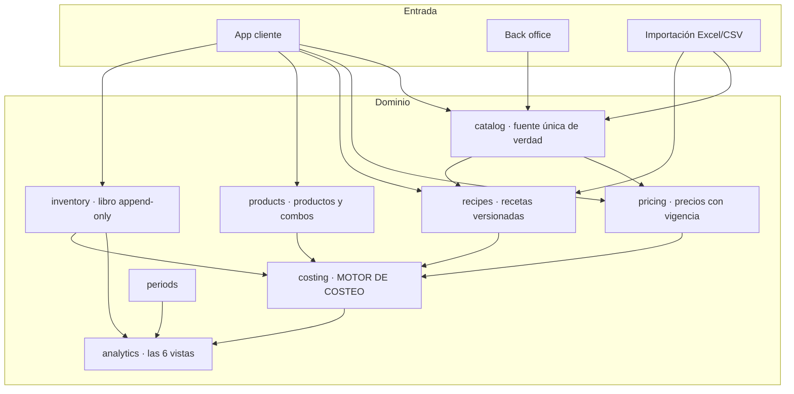
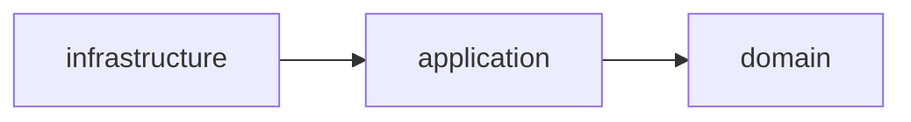
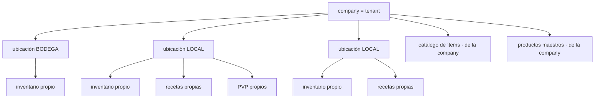

# Cómo funciona el sistema — documento maestro

> Se actualiza en cada paquete que cambie la estructura. Es el mapa que lee alguien que llega nuevo.

## Visión

## Regla de dependencia

El dominio no sabe que existe la infraestructura. El motor de costeo se ejecuta con la base de datos apagada.

## Jerarquía de datos

**El catálogo y los productos maestros viven en la company. El inventario, las recetas y los precios de venta viven en la ubicación.**

## Flujo del costo

```mermaid
graph LR
    PC[precio de compra] -->|quita IVA si recuperable| PN[precio neto]
    PN -->|divide por factor de conversión| CB[costo bruto por unidad de uso]
    CB -->|divide por rendimiento| CN[costo neto por unidad de uso]
    CN -->|cantidad × base EP| CL[costo de línea]
    CB -->|cantidad × base AP| CL
    CL -->|suma| LOTE[costo del lote]
    LOTE -->|divide por porciones| POR[costo por porción]
    POR -->|× 1 + merma no atribuible| MER[costo con merma]
    MER -->|+ empaque neto| TOT[COSTO TOTAL POR UNIDAD]
```

Las fórmulas exactas están en `docs/SPEC.md` §12 a §18.
