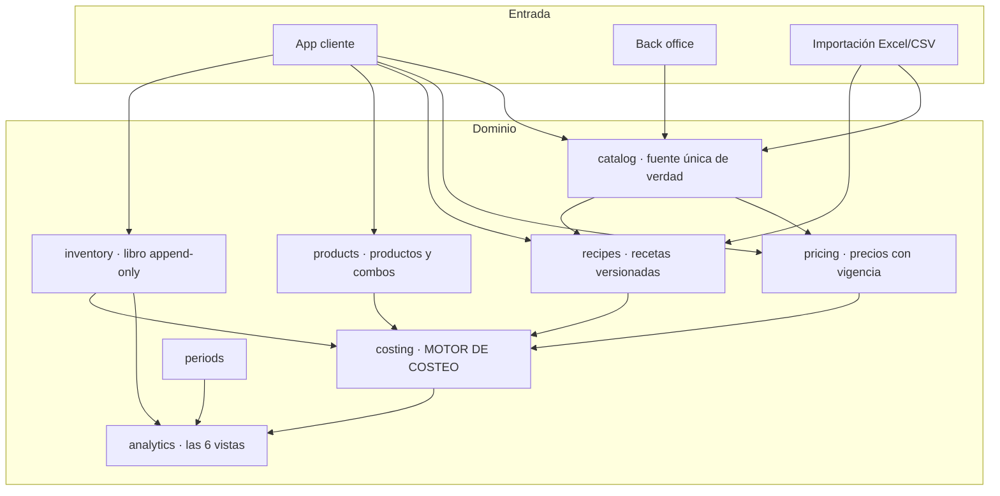
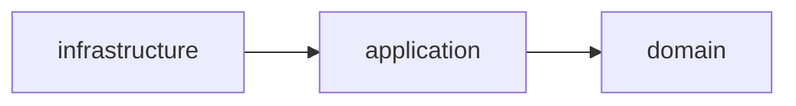
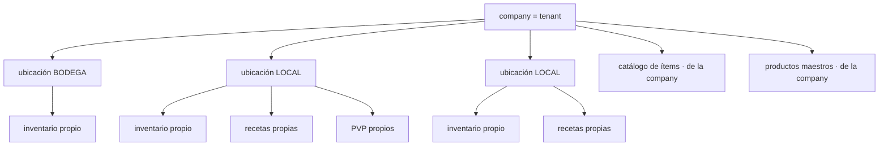
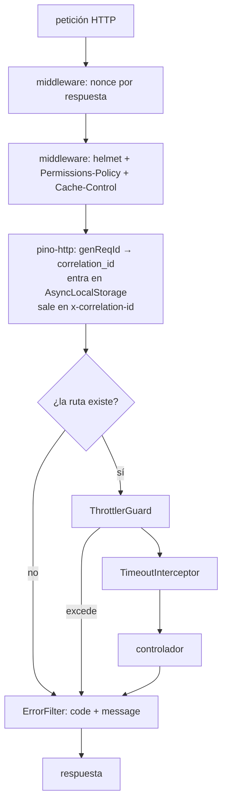
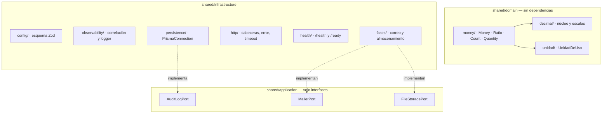

# Cómo funciona el sistema — documento maestro

> Se actualiza en cada paquete que cambie la estructura. Es el mapa que lee alguien que llega nuevo.

## Visión

## Regla de dependencia

El dominio no sabe que existe la infraestructura. El motor de costeo se ejecuta con la base de datos apagada.

## Jerarquía de datos

**El catálogo y los productos maestros viven en la company. El inventario, las recetas y los precios de venta viven en la ubicación.**

## Flujo del costo

```mermaid
graph LR
    PC[precio de compra] -->|quita IVA si recuperable| PN[precio neto]
    PN -->|divide por factor de conversión| CB[costo bruto por unidad de uso]
    CB -->|divide por rendimiento| CN[costo neto por unidad de uso]
    CN -->|cantidad × base EP| CL[costo de línea]
    CB -->|cantidad × base AP| CL
    CL -->|suma| LOTE[costo del lote]
    LOTE -->|divide por porciones| POR[costo por porción]
    POR -->|× 1 + merma no atribuible| MER[costo con merma]
    MER -->|+ empaque neto| TOT[COSTO TOTAL POR UNIDAD]
```

Las fórmulas exactas están en `docs/SPEC.md` §12 a §18.

---

## El proceso de la API por dentro (desde P0)

Lo que atraviesa una petición, en orden. Las cuatro protecciones globales se registran en `AppModule`/`bootstrap.ts`, de modo que **las pruebas levantan exactamente la misma aplicación que se despliega**: una defensa cableada solo en `main.ts` no existe en los tests, y entonces el test de que existe no prueba nada.

**Las cabeceras van como middleware de plataforma y no como interceptor de Nest, a propósito.** Un interceptor solo corre para peticiones que llegan a un manejador: un 404, un 429 del limitador o un cuerpo malformado saldrían **sin cabeceras**, y son justo las respuestas de las que un atacante aprende más. Hay una prueba de integración por cabecera que lo comprueba sobre un 404.

### Composición interna

`decimal.js` solo lo ve `shared/domain/decimal/` (ADR-003). `dependency-cruiser` y `audit:forbidden` lo hacen cumplir.

### Salud del proceso

| Ruta | Qué responde | Toca la base |
|---|---|---|
| `/health` | *liveness* — ¿el proceso está vivo? | **No** |
| `/ready` | *readiness* — ¿puede atender tráfico? | Sí |

La distinción tiene coste concreto: si `/health` mirara la base, un corte de PostgreSQL haría que el orquestador **matara y reiniciara todas las réplicas**, que es lo peor que puede pasar durante un corte de base de datos. Con `/ready`, la réplica sale del balanceador y vuelve sola.
