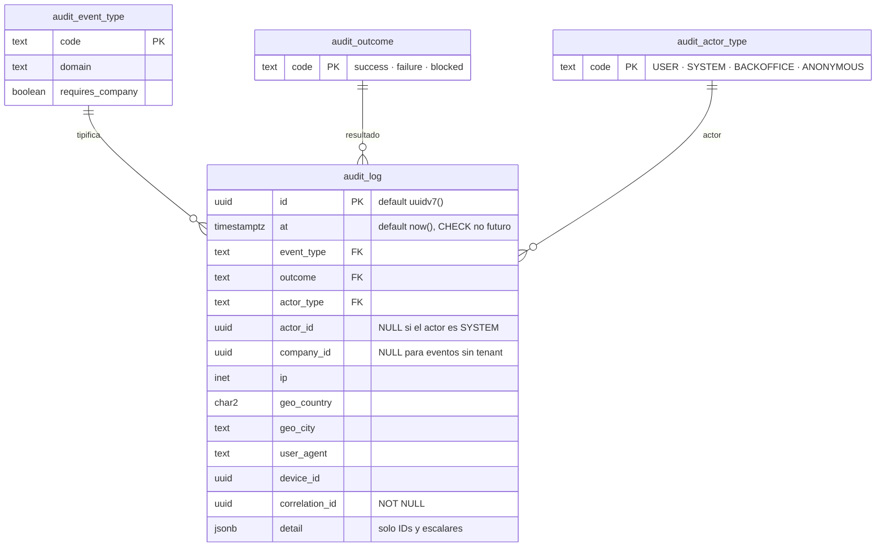
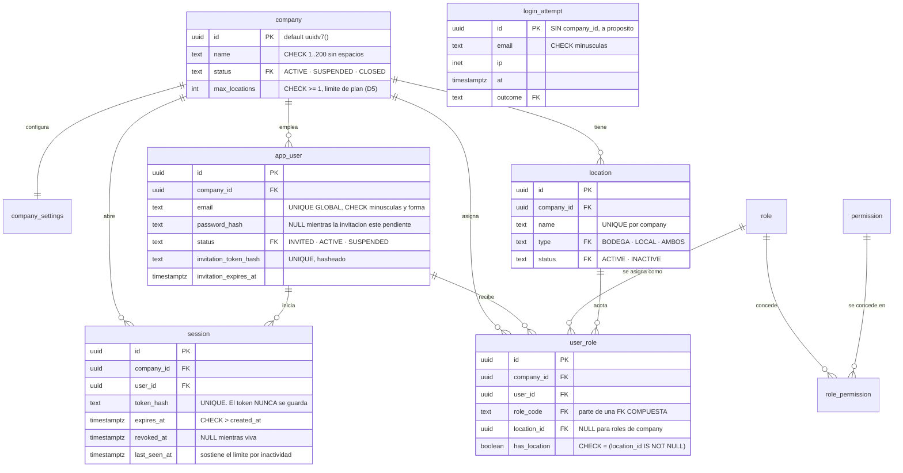
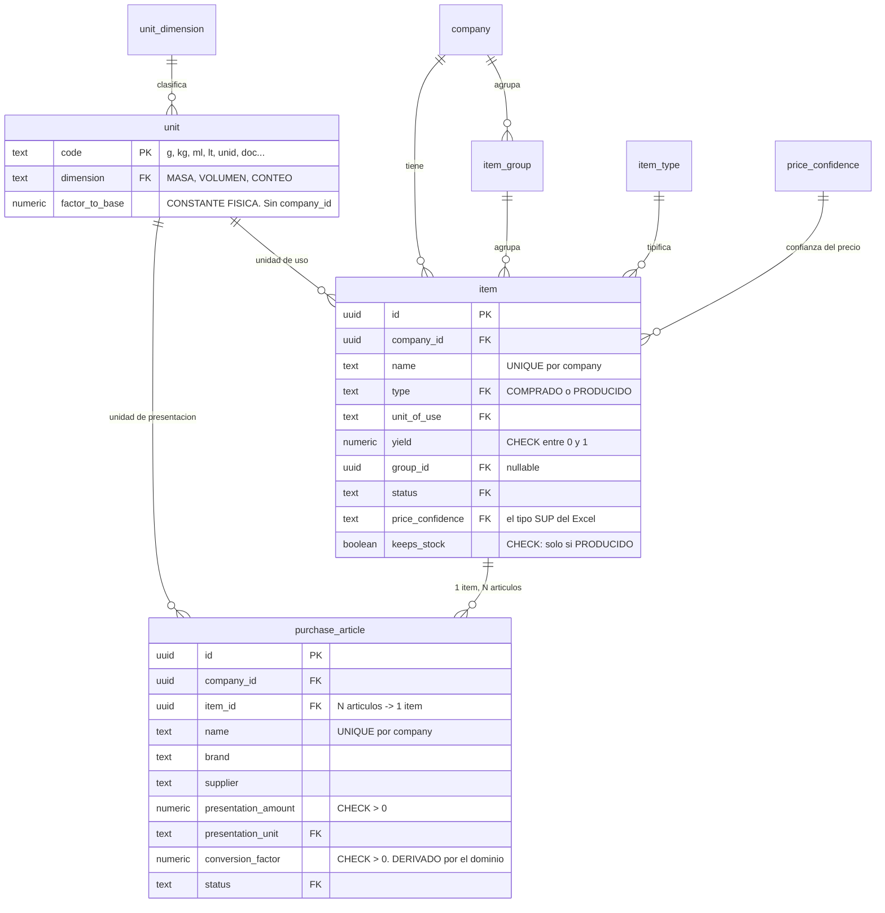
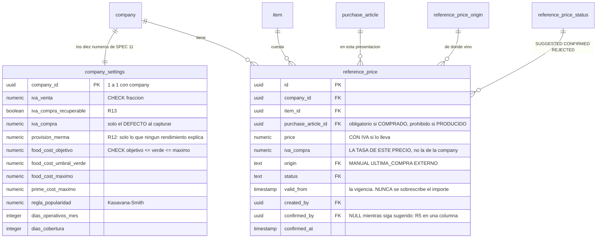
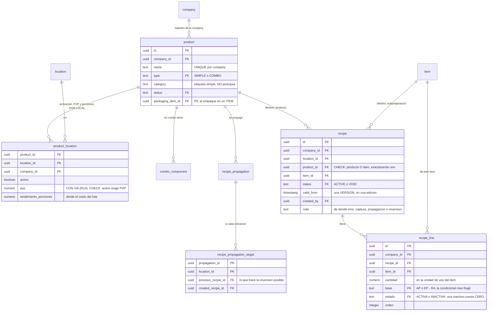
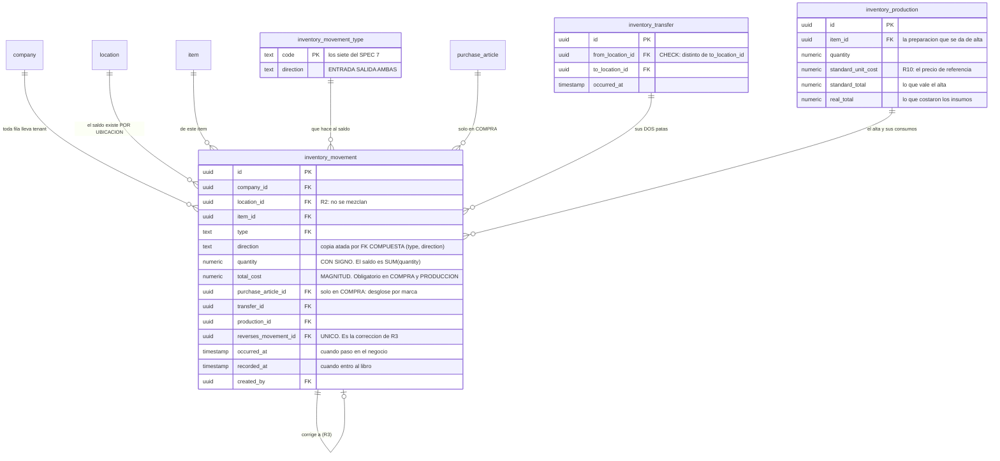
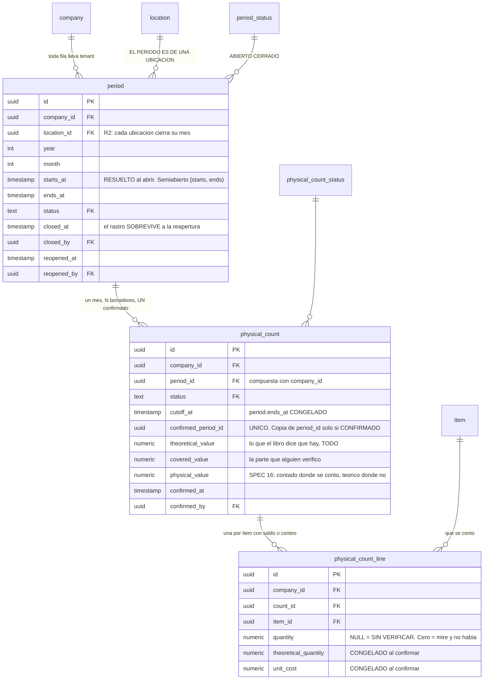

# Modelo de datos

> Se completa en cada paquete que cree tablas, **en el mismo commit**, con el diagrama de entidades actualizado.
> Estado: **P2**. Auditoría (P0), identidad y organización (P1) y catálogo (P2).

## Reglas transversales

- `company_id` en **toda** tabla de negocio, sin excepción
- RLS deny-by-default; políticas creadas **en la misma migración que crea la tabla**, no después
- UUID v7 como clave pública · `numeric` para dinero y cantidades · `timestamptz` para fechas
- Enums en tabla de catálogo, no en tipo nativo
- Sin borrado físico en entidades auditables
- **La tabla de movimientos de inventario es append-only**: sin `UPDATE`, sin `DELETE`

Las tres primeras no dependen de que nadie se acuerde: `audit:migrations` las comprueba en cada commit, y su lista de tablas exentas está **vacía**.

## Lo que existe hoy (P0)

### `audit_log` — SEGURIDAD.md §10

Es la primera tabla del sistema a propósito: el registro tiene que existir antes que aquello que registra.

**Append-only en tres capas**, y cada una cubre lo que la anterior no alcanza:

| # | Capa | A quién alcanza |
|---|---|---|
| 1 | `REVOKE UPDATE, DELETE, TRUNCATE` para `costeo_app` | Al rol de la aplicación |
| 2 | Trigger `BEFORE UPDATE OR DELETE OR TRUNCATE ... FOR EACH STATEMENT` | **También a la dueña de la tabla** |
| 3 | Regla `append-only-cliente-audit_log` de `audit:forbidden` | Al código, antes de llegar a la base |

**El trigger es de SENTENCIA y no de fila, y la distinción no es cosmética.** Con `FORCE ROW LEVEL SECURITY` activo y sin política de `DELETE`, un `DELETE FROM audit_log` ejecutado por la dueña afecta a **cero filas**: un trigger de fila nunca llegaría a dispararse y el borrado «tendría éxito» en silencio. Es el tipo de fallo que solo se descubre cuando hace falta la evidencia y ya no está. Hay una prueba de integración por cada capa.

**RLS deny-by-default desde P0.** La aplicación solo puede **insertar** eventos de sistema, y **no puede leer** el log: consultarlo es del back office (P11). La prueba que lo verifica comprueba además que el `0` que ve la aplicación es la política y no una tabla vacía — sin esa segunda comprobación, pasaría igual con RLS desactivado.

**`company_id` es nullable a propósito, y lo seguirá siendo.** El catálogo de §10 incluye eventos que por naturaleza no tienen tenant: `system.migration.applied`, `system.config.changed`, `system.ratelimit.exceeded`, `admin.login.*`. P1 añade la clave foránea con `ON DELETE RESTRICT` —**jamás `CASCADE`**: borrar una company no puede borrar su rastro— y el `CHECK` condicional contra `audit_event_type.requires_company`.

### Restricciones que ya están puestas

| Restricción | Qué impide |
|---|---|
| `audit_log_at_no_es_futuro` | Fechar evidencia por delante del reloj del servidor |
| `audit_log_actor_coherente` | Un actor `SYSTEM` con `actor_id`, o un `USER` sin él |
| `audit_log_event_type_fkey` | Un tipo de evento que no está en el catálogo |

Los catálogos son tablas y no `enum` nativos porque **añadir un valor a un enum de PostgreSQL exige una migración con bloqueo**, y este catálogo crece en cada paquete.

## Lo que añade P1 — identidad, organización y roles

### Cuatro decisiones de esquema que llevan una regla dentro

**El correo es único GLOBALMENTE, no por company.** El login ocurre **antes** de saber a qué tenant pertenece quien entra, así que una unicidad por company haría imposible resolver la credencial. La consecuencia es que un correo solo puede pertenecer a una company, y que el endpoint de invitación no puede decir si ya existe sin convertirse en un oráculo.

**`login_attempt` no tiene tenant, y es deliberado.** Se cuenta antes de saber quién entra. Se acota por otro lado: solo guarda correo e IP, ningún endpoint la expone, y su política RLS es `USING (true)` únicamente porque no hay tenant contra el que filtrar.

**La clave foránea de `user_role` es COMPUESTA** contra `role(code, requires_location)`, y `has_location` lleva un `CHECK` que le impide mentir respecto de `location_id`. Entre las dos, asignar `GERENTE_LOCAL` sin ubicación —o `ADMIN` con una— es imposible en la base, no solo desaconsejado.

**Dos índices únicos parciales donde uno no bastaba.** El del `OWNER` (`WHERE role_code = 'OWNER'`) lo hace único por company, y se prefiere a un trigger porque dos altas simultáneas se serializan en el índice mientras que un trigger que consulta y decide tiene una ventana de carrera. El segundo (`WHERE location_id IS NULL`) cubre un hueco menos evidente: **en PostgreSQL dos `NULL` son distintos para un índice único**, así que el `@@unique(user_id, role_code, location_id)` que genera Prisma no impide duplicar un rol de nivel company.

### Las tres funciones que leen sin tenant

Están inventariadas y justificadas en **ADR-006**. Son `auth_lookup(email)`, `session_lookup(token_hash)` e `invitation_lookup(token_hash)`: `SECURITY DEFINER`, con `SET search_path`, con `REVOKE EXECUTE FROM PUBLIC`, y sin ningún filtro más que su clave de entrada. **Que sean exactamente tres es parte de la decisión.**

### El `RETURNING` bajo RLS — INC-010

Una tabla cuya política de `SELECT` sea más estrecha que la de `INSERT` **no se puede escribir con `create()`**: Prisma emite `INSERT ... RETURNING` y el `RETURNING` pasa por la política de `SELECT`. Se usa `createMany`. Aplica hoy a `audit_log`, y aplicará en P6 a `inventory_movement` y en P11 a `cross_tenant_access_log`.

### El `down` de una migración y los catálogos — INC-011

**Un `down.sql` no borra filas de una tabla que no elimina.** Si otra tabla las referencia, el `down` falla en cuanto haya datos, y `migrate:verify` no lo ve porque corre sobre bases limpias. Lo hace cumplir la comprobación **M10** de `audit:migrations`.

## Lo que añade P2 — el catálogo

### El catálogo de unidades no tiene tenant

`factor_to_base` es una constante física, no una preferencia. Un catálogo por company significaría que cada una puede declarar que su kilo tiene 900 gramos, y ese error saldría como un **costo plausible y equivocado**. La aplicación no tiene ni `INSERT` sobre `unit`, y hay una prueba de integración que intenta el `UPDATE` y falla.

La contrapartida: no se pueden crear unidades propias («atado», «bandeja»). Se modelan como presentación del artículo —«atado de 6 unid»—, que es donde de verdad viven.

### No hay tabla de conversiones, y es deliberado

Entre unidades de la **misma dimensión** el factor es el cociente de sus `factor_to_base`: una tabla guardaría filas derivables, que es la clase de dato que se desincroniza. Entre **dimensiones distintas** —«un huevo pesa 50 g»— la conversión no es universal sino **del ítem**, y por eso vive en `purchase_article.conversion_factor`, calculada por el dominio al dar de alta el artículo.

### El índice de deduplicación es de expresión

`CREATE INDEX item_name_similitud ON item USING gin (lower(name) gin_trgm_ops)`. No una columna generada —Prisma no la sabe declarar y produciría deriva— ni una columna mantenida por la aplicación, que se desincroniza el día que alguien escriba por otra vía. `lower` es `IMMUTABLE`, que es todo lo que PostgreSQL exige.

Es **el único índice del proyecto sin consulta que lo use hoy**. Su consumidor es P10.

## Lo que añade P3 — precios con vigencia y parámetros de costeo

### La tasa de IVA vive en el precio, no en la company

El SPEC nombra `iva_compra` en la fórmula de §12 y **no dice dónde vive**; §11 solo trae «IVA de compra recuperable SI/NO». Se eligió el superconjunto: en Ecuador el alimento sin procesar es 0 % y el detergente 15 %, así que una tasa única por company estaría equivocada para uno de los dos, y el error entra directo en el costo de cada plato. `company_settings.iva_compra` es solo el valor que se **propone** al capturar.

**Es una decisión que merece confirmación del usuario** y está anotada como tal en `ESTADO.md`.

### Un precio no se actualiza: se añade

Lo único que cambia de una fila es su **estado**, y solo hacia adelante: `SUGGESTED` → `CONFIRMED` o `REJECTED`. Dos triggers lo hacen cumplir, porque el `GRANT UPDATE` que hace falta para confirmar no sabe distinguir «cambiar el estado» de «cambiar el importe».

De ahí sale **E8** —cambiar el precio de hoy no altera el costo del mes pasado— sin escribir nada más: la consulta de vigencia nunca mira una fila cuyo `valid_from` sea posterior a la fecha preguntada.

### La clave foránea del artículo es compuesta

`(purchase_article_id, item_id)` contra `purchase_article(id, item_id)`. Sin la segunda columna, un precio podría apuntar al saco de harina y al ítem «cebolla», y el costo por gramo saldría de una presentación que no es la suya.

---

## Lo que añade P4 — productos, recetas versionadas y propagación

### El destino de una receta es un producto O un ítem, exactamente uno

Un producto de venta tiene receta; una subpreparación —ítem `PRODUCIDO`— también, y ahí está la recursión que **R9** corta. Un `CHECK` con `<>` sobre dos `IS NOT NULL` lo hace imposible de violar: sin él cabría una receta sin destino, que no significa nada, y una con dos, que significa dos cosas contradictorias.

### `recipe_status` incluye `VOID`, y hace falta

Es la versión que dice «aquí no hay receta». Sin ella, revertir una propagación sobre una ubicación que no tenía receta obligaría a **borrar** la versión creada —reescribiendo la historia— o a dejar una receta vacía. **Una receta vacía cuesta cero**, que es un número plausible y equivocado.

### Una receta no se puede editar, y lo impide un trigger

`recipe` no necesita `UPDATE` para nada, pero un `GRANT` olvidado en el futuro lo abriría en silencio. Con el trigger, «una receta se versiona, no se edita» es cierto por construcción.

### `recipe_propagation_target` no tiene `company_id` propio

Cuelga de la propagación, que sí lo tiene, y su política de RLS se apoya en esa fila con un `EXISTS`. Una columna repetida sería un segundo sitio donde el tenant podría discrepar.

### Todas las claves foráneas de P4 son compuestas

Contra `product(id, company_id)` e `item(id, company_id)`. Todo lo que una receta referencia es de la misma company — y eso lo garantiza la clave, no una comprobación de aplicación que alguien puede olvidar. **RLS filtra lo que se lee, no lo que se referencia.**

---

## Lo que añade P5 — el empaque y el índice del costeo

**P5 no crea ninguna tabla.** El motor de costeo es dominio puro y no persiste nada. Lo que la base necesita es lo único que el motor no puede inventarse.

| Cambio | Qué es |
|---|---|
| `product.packaging_item_id` | El ítem que hace de empaque. Anulable: `NULL` = el producto no lleva envase |
| Índice `recipe_por_ubicacion_y_vigencia` | `(company_id, location_id, valid_from DESC)` |
| Permiso `costing.read` | Para `OWNER`, `ADMIN`, `GERENTE_LOCAL` y `LECTURA`. **`BODEGA` no aparece** |

### El empaque es un ítem, no una tabla propia

`T4_EMPAQUES` del Excel es una tabla aparte con su precio y su IVA. Aquí no: un empaque se compra, tiene artículo, tiene precio con vigencia y un día se cuenta en el inventario. Darle tabla propia habría duplicado la cadena de costo entera —un segundo sitio donde viven precios— y **R13** habría que implementarla dos veces.

Con esto, `empaque_neto` de SPEC §14 es exactamente el `costo_neto_uso` del ítem: la misma fórmula, sin una línea nueva. El razonamiento completo, con lo que cuesta, está en **ADR-008**.

La clave foránea es **compuesta** contra `item(id, company_id)`: el empaque de un producto tiene que ser de la misma company.

### El índice nuevo tiene su consulta delante

Los índices de P4 empiezan por `(company_id, product_id, …)` y sirven para «la receta de **este** producto». Costear una carta entera pide **todas** las recetas vigentes de una ubicación de una vez, y esa consulta no lleva `product_id`. Sin el índice es un `Seq Scan` sobre `recipe`.

Medido con 200 productos y 1.600 líneas: `Bitmap Index Scan` con 5 buffers y 0,34 ms. El plan está en `docs/pasos/P5/evidencia/explain-analyze.txt`, y hay una prueba de integración que **falla si aparece un `Seq Scan`** — el tiempo depende de la máquina, el plan no.

---

## Lo que añade P6 — el libro mayor de inventario

### No hay campo `stock`, y no lo va a haber

El saldo de un ítem en una ubicación es `SUM(quantity)` sobre el libro, y nada más. Un campo mutable sería un segundo número capaz de discrepar, y cuando discrepara nadie sabría cuál de los dos es el bueno. El libro append-only siempre puede decir **por qué** el saldo es el que es.

Se comprueba en las dos direcciones: hay una prueba que reconstruye el saldo plegando los movimientos **crudos** en TypeScript —sin pasar por el repositorio— y exige que coincida hasta el último dígito con el `SUM` de la consulta. Es el criterio de aceptación de P6.

### La cantidad lleva signo, y la dirección viaja en la fila

`quantity` es positiva si entra y negativa si sale. Eso convierte el saldo en una suma y hace que R3 sea literal: corregir es `negated()`.

El precio de esa comodidad es que ahora se puede escribir al revés, y una `COMPRA` negativa es un saldo equivocado perfectamente plausible. Lo cierran tres piezas encadenadas:

| | |
|---|---|
| `CHECK` `..._signo_segun_direccion` | cruza `direction` con el signo de `quantity` |
| columna `direction` | porque **un `CHECK` no puede consultar otra tabla** |
| FK **compuesta** `(type, direction)` | para que esa copia no pueda discrepar de su catálogo |

Sin la tercera la primera sería burlable: bastaría declarar `('COMPRA', 'SALIDA')`. Es el mismo mecanismo con el que P3 ató el artículo de compra a su ítem. Razonado en **ADR-009**.

**La única excepción está acotada a la corrección**: el `CHECK` se salta la comprobación exactamente cuando `reverses_movement_id` no es nulo. Corregir una `COMPRA` produce una `COMPRA` negativa —tiene que ser del mismo tipo o `compras_del_mes` no se cancelaría— y su cantidad no la escribe nadie: se deriva.

### Se guarda el importe TOTAL, no el unitario

Al comprar, el hecho es la factura. Reconstruirla como `cantidad × costo_unitario` obliga a una división previa cuyo redondeo pierde centavos, y `compras_del_mes` (SPEC §16) dejaría de cuadrar con lo que el cliente pagó. El unitario sigue siendo calculable; no se guarda porque un derivado guardado es un segundo sitio donde el número puede discrepar.

`total_cost` es **magnitud sin signo**: el sentido lo lleva la cantidad.

### El movimiento no guarda la unidad de uso

Sería un segundo sitio donde la unidad podría discrepar de la del ítem. Y no hace falta: **`ActualizarItem` no permite cambiar `unit_of_use`** desde P2 —cambiarla convertiría 200 «g» históricos en 200 «kg» sin tocar una fila—, así que no puede derivar.

### `PRODUCCION` es bidireccional, y lo que la protege no es el signo

Una producción mueve el libro en los dos sentidos a la vez: da de alta la preparación y consume sus insumos. Las dos mitades son el mismo hecho, así que comparten `production_id`, y un `CHECK` exige que todo movimiento `PRODUCCION` lo tenga. Lo mismo con las dos patas de una transferencia y `transfer_id`.

**Efecto secundario buscado:** como el alta lleva el costo estándar y los consumos el real, la suma de los importes de los movimientos `PRODUCCION` de un lote **es** la varianza. No hay que reconstruirla desde ningún sitio.

### Append-only en tres capas, igual que `audit_log`

1. `REVOKE UPDATE, DELETE, TRUNCATE` para `costeo_app`
2. Trigger `BEFORE ... FOR EACH STATEMENT` con la `rechazar_mutacion()` de P0 — **de sentencia y no de fila**, porque con `FORCE ROW LEVEL SECURITY` un `DELETE` de la dueña afecta a cero filas y un trigger de fila nunca llegaría a dispararse
3. `audit:forbidden`, que rompe el build en el editor

Las tres cubren también `inventory_transfer` e `inventory_production`: son cabeceras de hechos que ya están en el libro.

### Los índices tienen su consulta delante

| Índice | Consulta |
|---|---|
| `(company_id, location_id, occurred_at)` | la agregación del saldo de una ubicación |
| `(company_id, location_id, item_id, occurred_at)` | el libro paginado de un ítem |
| `(company_id, transfer_id)` · `(company_id, production_id)` | recuperar las patas de un hecho |

Medido con **1,2 millones de movimientos** en la tabla y 12.000 en la ubicación consultada: `Index Scan` en las dos, p95 de **60,8 ms** contra 300 de presupuesto. El plan está en `docs/pasos/P6/evidencia/explain-analyze.txt`, y hay una prueba que **falla ante un `Seq Scan`**.

**Un detalle que costó descubrir y quedó escrito en la prueba:** con una sola ubicación en la tabla, PostgreSQL elige `Seq Scan` — correctamente, porque la tabla entera es el resultado. La prueba siembra 19 ubicaciones de ruido para que el filtro tenga algo que descartar. Sin eso, el check del plan no medía nada.

## Lo que añade P7 — el mes contable y el conteo físico

### El período es de una ubicación, y su frontera son dos instantes

`occurred_at` es un instante absoluto y el mes al que pertenece depende de la
zona horaria. `starts_at` y `ends_at` se resuelven **una vez**, al abrir el
período, con la zona de `config/periods.ts`; a partir de ahí todo es una
comparación de instantes, en SQL y en TypeScript, sin `AT TIME ZONE` en ninguna
consulta.

El precio de no hacerlo se ve en el plan: con `date_trunc('month', occurred_at
AT TIME ZONE …)` la agregación del saldo hasta el corte sería un `Seq Scan`
sobre todo el libro. Con instantes, el `hasta` entra en la misma condición de
índice que el tenant y la ubicación — y **P7 no necesitó ningún índice nuevo
sobre `inventory_movement`**.

Razonado en **ADR-010 §1 y §2**.

### La ausencia de fila es el estado abierto

No hay fila para los meses de los que nadie se ha ocupado. La alternativa
—exigir abrir el mes— pararía el sistema el día 1 de cada mes.

Consecuencia en el modelo: `period` nace `ABIERTO` cuando alguien abre un conteo
o cierra el mes, y `reopened_at` solo puede estar relleno si `closed_at` lo
está. Un `CHECK` lo hace cumplir.

### `NULL` en `quantity` no es cero, y esa distinción es D7

| | |
|---|---|
| `quantity = 0` | **alguien miró y no había** |
| `quantity IS NULL` | **nadie miró** — no genera diferencia |

Mientras el conteo es `BORRADOR` solo existen líneas de lo que se anotó. Al
**confirmar** se materializa una línea por cada ítem con saldo, con `quantity`
nula en los que nadie contó, y se congelan `theoretical_quantity` y `unit_cost`.

A partir de ahí la conciliación entera es **una lectura de esta tabla**: 500
filas en 0,165 ms, y da el mismo número dentro de un año aunque después entre un
precio con vigencia retroactiva.

### El conteo no ajusta el libro, y el libro no sabe que hubo conteo

No hay ninguna clave foránea de `inventory_movement` hacia `physical_count`, y
confirmar no escribe ni un movimiento. Si lo hiciera, `diferencia = conteo −
teorico` (SPEC §18) daría cero siempre y la señal desaparecería al registrarla.

### «Un solo confirmado por período», con una columna anulable

`confirmed_period_id` es una copia de `period_id` que solo existe cuando el
conteo está `CONFIRMADO`, con índice único, y dos `CHECK` que la atan a su
original. Dice lo mismo que `CREATE UNIQUE INDEX … WHERE status = 'CONFIRMADO'`,
que Prisma no sabe declarar: un índice parcial tendría que vivir en el bloque
`MANUAL` y podría aparecer como deriva en `migrate:verify`.

Sin la restricción, `inventario_final_fisico` de SPEC §16 dependería de cuál
conteo eligiera cada consulta.

### Lo inmutable es la FILA confirmada, no la tabla

Al revés que en `audit_log` y en el libro, donde la tabla entera es
append-only y basta con negar la sentencia. Aquí los triggers son `FOR EACH ROW`
porque hay que distinguir qué fila está confirmada, y para eso hace falta `OLD`.

| Trigger | Qué impide |
|---|---|
| `physical_count_confirmado_no_se_edita` | Editar o borrar un conteo confirmado |
| `physical_count_line_solo_en_borrador` | Insertar, editar o borrar líneas de un conteo confirmado |
| `inventory_movement_respeta_periodo_cerrado` | Insertar en el libro con fecha dentro de un mes cerrado |

El tercero alcanza también al dueño de la tabla: la siembra de la prueba de
rendimiento chocó contra el segundo ejecutando como `costeo_migrator`.

### Los índices tienen su consulta delante

| Índice | Consulta |
|---|---|
| `period (company_id, location_id, starts_at)` | la guarda del mes cerrado, que hace **toda** escritura del libro |
| `period (company_id, location_id, year, month)` único | el mes de una ubicación |
| `physical_count (company_id, period_id)` | los conteos de un mes |
| `physical_count_line (company_id, count_id)` | la conciliación congelada |

**No hay índice parcial sobre los cerrados**, y no por olvido: `period` tiene
doce filas por ubicación y año, el índice completo la resuelve en 0,096 ms, y un
índice que Prisma no sabe declarar podría aparecer como deriva. El plan está en
`docs/pasos/P7/evidencia/explain-analyze.txt`.

---

## Entidades por paquete

| Paquete | Entidades | Estado |
|---|---|---|
| **P0** | `audit_log`, `audit_event_type`, `audit_outcome`, `audit_actor_type` | ✅ |
| **P1** | `company`, `company_settings`, `location`, `app_user`, `role`, `permission`, `role_permission`, `user_role`, `session`, `login_attempt` + 4 catálogos | ✅ |
| **P2** | `item`, `purchase_article`, `item_group` + `unit`, `unit_dimension`, `item_type`, `item_status`, `price_confidence` | ✅ |
| **P3** | `reference_price` + `reference_price_origin`, `reference_price_status`. **`company_settings` se adelantó a P1** | ✅ |
| **P4** | `product`, `product_location`, `combo_component`, `recipe`, `recipe_line`, `recipe_propagation`, `recipe_propagation_target` + 5 catálogos | ✅ |
| **P5** | **Ninguna tabla nueva.** El motor es dominio puro: añade `product.packaging_item_id`, un índice y el permiso `costing.read` | ✅ |
| **P6** | `inventory_movement`, `inventory_transfer`, `inventory_production` + `inventory_movement_type`. **No hay `inventory_balance`**, y era lo previsto: el saldo es una agregación sobre el libro, no una tabla — R3 | ✅ |
| **P7** | `period`, `physical_count`, `physical_count_line` + `period_status`, `physical_count_status`. **El conteo no ajusta el libro**: no hay clave foránea de `inventory_movement` hacia aquí, y confirmar no escribe ni un movimiento | ✅ |
| P8 | vistas materializadas de período cerrado | ⬜ |
| P10 | `import_job`, `import_row` | ⬜ |
| P11 | `plan`, `subscription`, `cross_tenant_access_log` | ⬜ |

## Índices

**Los de `CLAUDE.md` §5 están todos puestos desde P6**, cada uno con su consulta delante: **ningún índice sin consulta que lo justifique.** Los dos últimos que faltaban —los de movimientos— llegaron con el libro.

`audit_log` lleva dos, con consumidor concreto en P11: `(at DESC)` para el listado cronológico y `(correlation_id)` para reconstruir una petición entera.

Los de P1, todos con su consulta delante:

| Índice | Consulta que lo justifica |
|---|---|
| `app_user(email)` único | `auth_lookup`: la única lectura del login |
| `app_user(invitation_token_hash)` único | `invitation_lookup`: activar una invitación |
| `app_user(company_id, status)` | Listar usuarios de una company |
| `session(token_hash)` único | `session_lookup`: **una vez por petición autenticada** |
| `session(company_id, user_id, expires_at)` | Revocar todas las sesiones de un usuario |
| `location(company_id, name)` único | Nombre de ubicación único por company |
| `location(company_id, status)` | Listado de ubicaciones activas |
| `user_role(company_id, user_id)` | Capacidades efectivas dentro de `session_lookup` |
| `login_attempt(email, at DESC)` · `(ip, at DESC)` | Los dos ejes de la política anti fuerza bruta |
| `item(company_id, name)` único · `(company_id, status)` · `(company_id, type)` | Listado de ítems, filtrado por estado y por tipo |
| `purchase_article(company_id, item_id)` | Los artículos de un ítem — la consulta de «N artículos → 1 ítem» |
| `purchase_article(company_id, name)` único | Nombre de artículo único por company |
| `item_group(company_id, name)` único | Nombre de grupo único por company |
| `item_name_similitud` (GIN, trigrama) | **Sin consulta hoy.** Deduplicación de P10 |
| `reference_price(company_id, item_id, valid_from DESC)` | El índice de §5: precio vigente de un ítem. Igualdad antes que rango |
| `reference_price(company_id, status)` | Los precios pendientes de confirmar, y la carga en lote del costeo |
| `product(company_id, name)` único · `(company_id, status)` | Nombre único y listado de productos activos |
| `product_location(company_id, location_id)` | La carta de una ubicación |
| `recipe(company_id, product_id, location_id, valid_from DESC)` | El índice de §5: receta vigente de un producto en una ubicación |
| `recipe(company_id, item_id, location_id, valid_from DESC)` | Lo mismo para una subpreparación |
| **`recipe(company_id, location_id, valid_from DESC)`** | **P5:** TODAS las recetas vigentes de una ubicación, para costear la carta de una vez. Sin él, `Seq Scan` |
| `recipe_line(company_id, recipe_id)` · `(recipe_id, item_id)` único | Las líneas de una receta; un ítem no se repite en la misma |
| `recipe_propagation(company_id, product_id, propagated_at DESC)` | Las propagaciones de un producto, de la más reciente |
| **`inventory_movement(company_id, location_id, occurred_at)`** | **P6, y es de §5:** «movimientos de una ubicación en un rango de fechas». Es el que usa la agregación del saldo |
| **`inventory_movement(company_id, location_id, item_id, occurred_at)`** | **P6, y es de §5:** «saldo actual de un ítem en una ubicación». Lo usa el libro paginado |
| `inventory_movement(company_id, transfer_id)` · `(company_id, production_id)` | Recuperar las dos patas de una transferencia o los movimientos de un lote |
| `inventory_movement(reverses_movement_id)` único | Es la restricción, no una optimización: **un movimiento se corrige una sola vez** |
| **`period(company_id, location_id, starts_at)`** | **P7:** la guarda del mes cerrado, que hace **toda** escritura del libro. 0,096 ms con 240 períodos en la tabla |
| `period(company_id, location_id, year, month)` único | Un mes de una ubicación existe una sola vez |
| `physical_count(confirmed_period_id)` único | Es la restricción: **un solo conteo confirmado por período**, o `inventario_final_fisico` (SPEC §16) sería ambiguo |
| `physical_count(company_id, period_id)` · `physical_count_line(company_id, count_id)` | Los conteos de un mes y la conciliación congelada: 500 filas en 0,165 ms |
| `physical_count_line(count_id, item_id)` único | Un ítem no se cuenta dos veces en el mismo conteo |

**P7 no añadió ningún índice sobre `inventory_movement`**, y merece decirse: el corte del conteo (`occurred_at < cutoff_at`) entra en la misma condición del índice de P6 que el tenant y la ubicación. Es lo que se gana guardando la frontera del mes como un instante en vez de calcularla con `date_trunc` en cada consulta.
| `inventory_transfer(company_id, occurred_at DESC)` · `inventory_production(company_id, location_id, occurred_at DESC)` | El historial de transferencias y de lotes |
