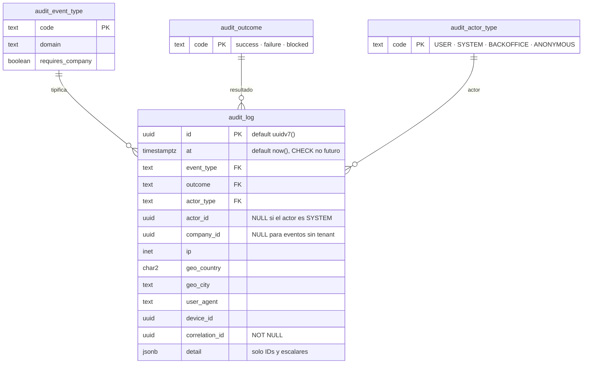
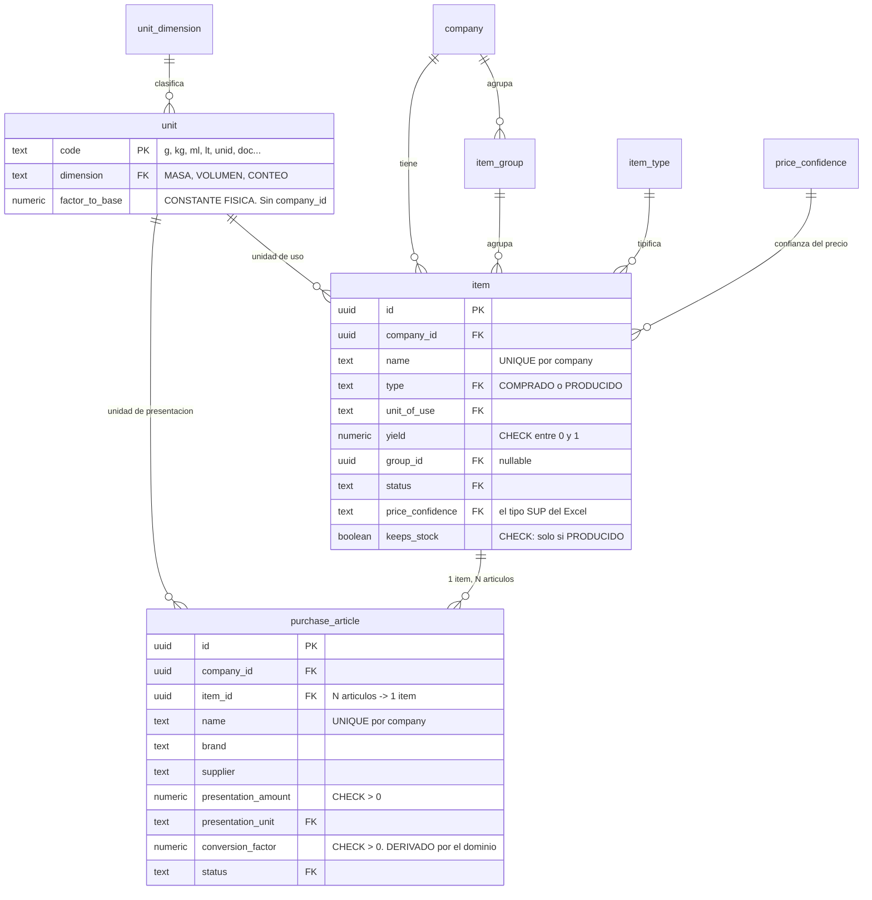

# Modelo de datos

> Se completa en cada paquete que cree tablas, **en el mismo commit**, con el diagrama de entidades actualizado.
> Estado: **P2**. Auditoría (P0), identidad y organización (P1) y catálogo (P2).

## Reglas transversales

- `company_id` en **toda** tabla de negocio, sin excepción
- RLS deny-by-default; políticas creadas **en la misma migración que crea la tabla**, no después
- UUID v7 como clave pública · `numeric` para dinero y cantidades · `timestamptz` para fechas
- Enums en tabla de catálogo, no en tipo nativo
- Sin borrado físico en entidades auditables
- **La tabla de movimientos de inventario es append-only**: sin `UPDATE`, sin `DELETE`

Las tres primeras no dependen de que nadie se acuerde: `audit:migrations` las comprueba en cada commit, y su lista de tablas exentas está **vacía**.

## Lo que existe hoy (P0)

### `audit_log` — SEGURIDAD.md §10

Es la primera tabla del sistema a propósito: el registro tiene que existir antes que aquello que registra.

**Append-only en tres capas**, y cada una cubre lo que la anterior no alcanza:

| # | Capa | A quién alcanza |
|---|---|---|
| 1 | `REVOKE UPDATE, DELETE, TRUNCATE` para `costeo_app` | Al rol de la aplicación |
| 2 | Trigger `BEFORE UPDATE OR DELETE OR TRUNCATE ... FOR EACH STATEMENT` | **También a la dueña de la tabla** |
| 3 | Regla `append-only-cliente-audit_log` de `audit:forbidden` | Al código, antes de llegar a la base |

**El trigger es de SENTENCIA y no de fila, y la distinción no es cosmética.** Con `FORCE ROW LEVEL SECURITY` activo y sin política de `DELETE`, un `DELETE FROM audit_log` ejecutado por la dueña afecta a **cero filas**: un trigger de fila nunca llegaría a dispararse y el borrado «tendría éxito» en silencio. Es el tipo de fallo que solo se descubre cuando hace falta la evidencia y ya no está. Hay una prueba de integración por cada capa.

**RLS deny-by-default desde P0.** La aplicación solo puede **insertar** eventos de sistema, y **no puede leer** el log: consultarlo es del back office (P11). La prueba que lo verifica comprueba además que el `0` que ve la aplicación es la política y no una tabla vacía — sin esa segunda comprobación, pasaría igual con RLS desactivado.

**`company_id` es nullable a propósito, y lo seguirá siendo.** El catálogo de §10 incluye eventos que por naturaleza no tienen tenant: `system.migration.applied`, `system.config.changed`, `system.ratelimit.exceeded`, `admin.login.*`. P1 añade la clave foránea con `ON DELETE RESTRICT` —**jamás `CASCADE`**: borrar una company no puede borrar su rastro— y el `CHECK` condicional contra `audit_event_type.requires_company`.

### Restricciones que ya están puestas

| Restricción | Qué impide |
|---|---|
| `audit_log_at_no_es_futuro` | Fechar evidencia por delante del reloj del servidor |
| `audit_log_actor_coherente` | Un actor `SYSTEM` con `actor_id`, o un `USER` sin él |
| `audit_log_event_type_fkey` | Un tipo de evento que no está en el catálogo |

Los catálogos son tablas y no `enum` nativos porque **añadir un valor a un enum de PostgreSQL exige una migración con bloqueo**, y este catálogo crece en cada paquete.

## Lo que añade P1 — identidad, organización y roles

### Cuatro decisiones de esquema que llevan una regla dentro

**El correo es único GLOBALMENTE, no por company.** El login ocurre **antes** de saber a qué tenant pertenece quien entra, así que una unicidad por company haría imposible resolver la credencial. La consecuencia es que un correo solo puede pertenecer a una company, y que el endpoint de invitación no puede decir si ya existe sin convertirse en un oráculo.

**`login_attempt` no tiene tenant, y es deliberado.** Se cuenta antes de saber quién entra. Se acota por otro lado: solo guarda correo e IP, ningún endpoint la expone, y su política RLS es `USING (true)` únicamente porque no hay tenant contra el que filtrar.

**La clave foránea de `user_role` es COMPUESTA** contra `role(code, requires_location)`, y `has_location` lleva un `CHECK` que le impide mentir respecto de `location_id`. Entre las dos, asignar `GERENTE_LOCAL` sin ubicación —o `ADMIN` con una— es imposible en la base, no solo desaconsejado.

**Dos índices únicos parciales donde uno no bastaba.** El del `OWNER` (`WHERE role_code = 'OWNER'`) lo hace único por company, y se prefiere a un trigger porque dos altas simultáneas se serializan en el índice mientras que un trigger que consulta y decide tiene una ventana de carrera. El segundo (`WHERE location_id IS NULL`) cubre un hueco menos evidente: **en PostgreSQL dos `NULL` son distintos para un índice único**, así que el `@@unique(user_id, role_code, location_id)` que genera Prisma no impide duplicar un rol de nivel company.

### Las tres funciones que leen sin tenant

Están inventariadas y justificadas en **ADR-006**. Son `auth_lookup(email)`, `session_lookup(token_hash)` e `invitation_lookup(token_hash)`: `SECURITY DEFINER`, con `SET search_path`, con `REVOKE EXECUTE FROM PUBLIC`, y sin ningún filtro más que su clave de entrada. **Que sean exactamente tres es parte de la decisión.**

### El `RETURNING` bajo RLS — INC-010

Una tabla cuya política de `SELECT` sea más estrecha que la de `INSERT` **no se puede escribir con `create()`**: Prisma emite `INSERT ... RETURNING` y el `RETURNING` pasa por la política de `SELECT`. Se usa `createMany`. Aplica hoy a `audit_log`, y aplicará en P6 a `inventory_movement` y en P11 a `cross_tenant_access_log`.

### El `down` de una migración y los catálogos — INC-011

**Un `down.sql` no borra filas de una tabla que no elimina.** Si otra tabla las referencia, el `down` falla en cuanto haya datos, y `migrate:verify` no lo ve porque corre sobre bases limpias. Lo hace cumplir la comprobación **M10** de `audit:migrations`.

## Lo que añade P2 — el catálogo

### El catálogo de unidades no tiene tenant

`factor_to_base` es una constante física, no una preferencia. Un catálogo por company significaría que cada una puede declarar que su kilo tiene 900 gramos, y ese error saldría como un **costo plausible y equivocado**. La aplicación no tiene ni `INSERT` sobre `unit`, y hay una prueba de integración que intenta el `UPDATE` y falla.

La contrapartida: no se pueden crear unidades propias («atado», «bandeja»). Se modelan como presentación del artículo —«atado de 6 unid»—, que es donde de verdad viven.

### No hay tabla de conversiones, y es deliberado

Entre unidades de la **misma dimensión** el factor es el cociente de sus `factor_to_base`: una tabla guardaría filas derivables, que es la clase de dato que se desincroniza. Entre **dimensiones distintas** —«un huevo pesa 50 g»— la conversión no es universal sino **del ítem**, y por eso vive en `purchase_article.conversion_factor`, calculada por el dominio al dar de alta el artículo.

### El índice de deduplicación es de expresión

`CREATE INDEX item_name_similitud ON item USING gin (lower(name) gin_trgm_ops)`. No una columna generada —Prisma no la sabe declarar y produciría deriva— ni una columna mantenida por la aplicación, que se desincroniza el día que alguien escriba por otra vía. `lower` es `IMMUTABLE`, que es todo lo que PostgreSQL exige.

Es **el único índice del proyecto sin consulta que lo use hoy**. Su consumidor es P10.

## Entidades por paquete

| Paquete | Entidades | Estado |
|---|---|---|
| **P0** | `audit_log`, `audit_event_type`, `audit_outcome`, `audit_actor_type` | ✅ |
| **P1** | `company`, `company_settings`, `location`, `app_user`, `role`, `permission`, `role_permission`, `user_role`, `session`, `login_attempt` + 4 catálogos | ✅ |
| **P2** | `item`, `purchase_article`, `item_group` + `unit`, `unit_dimension`, `item_type`, `item_status`, `price_confidence` | ✅ |
| P3 | `reference_price` | ⬜ |
| P4 | `product`, `product_location`, `recipe`, `recipe_line`, `combo_component`, `recipe_propagation_log` | ⬜ |
| P6 | `inventory_movement`, `inventory_balance` (proyección), `production_batch` | ⬜ |
| P7 | `period`, `physical_count`, `physical_count_line` | ⬜ |
| P8 | vistas materializadas de período cerrado | ⬜ |
| P10 | `import_job`, `import_row` | ⬜ |
| P11 | `plan`, `subscription`, `cross_tenant_access_log` | ⬜ |

## Índices

Ninguno de los de `CLAUDE.md` §5 aplica todavía —los de inventario y precios llegan con sus consultas—: **ningún índice sin consulta que lo justifique.**

`audit_log` lleva dos, con consumidor concreto en P11: `(at DESC)` para el listado cronológico y `(correlation_id)` para reconstruir una petición entera.

Los de P1, todos con su consulta delante:

| Índice | Consulta que lo justifica |
|---|---|
| `app_user(email)` único | `auth_lookup`: la única lectura del login |
| `app_user(invitation_token_hash)` único | `invitation_lookup`: activar una invitación |
| `app_user(company_id, status)` | Listar usuarios de una company |
| `session(token_hash)` único | `session_lookup`: **una vez por petición autenticada** |
| `session(company_id, user_id, expires_at)` | Revocar todas las sesiones de un usuario |
| `location(company_id, name)` único | Nombre de ubicación único por company |
| `location(company_id, status)` | Listado de ubicaciones activas |
| `user_role(company_id, user_id)` | Capacidades efectivas dentro de `session_lookup` |
| `login_attempt(email, at DESC)` · `(ip, at DESC)` | Los dos ejes de la política anti fuerza bruta |
| `item(company_id, name)` único · `(company_id, status)` · `(company_id, type)` | Listado de ítems, filtrado por estado y por tipo |
| `purchase_article(company_id, item_id)` | Los artículos de un ítem — la consulta de «N artículos → 1 ítem» |
| `purchase_article(company_id, name)` único | Nombre de artículo único por company |
| `item_group(company_id, name)` único | Nombre de grupo único por company |
| `item_name_similitud` (GIN, trigrama) | **Sin consulta hoy.** Deduplicación de P10 |
