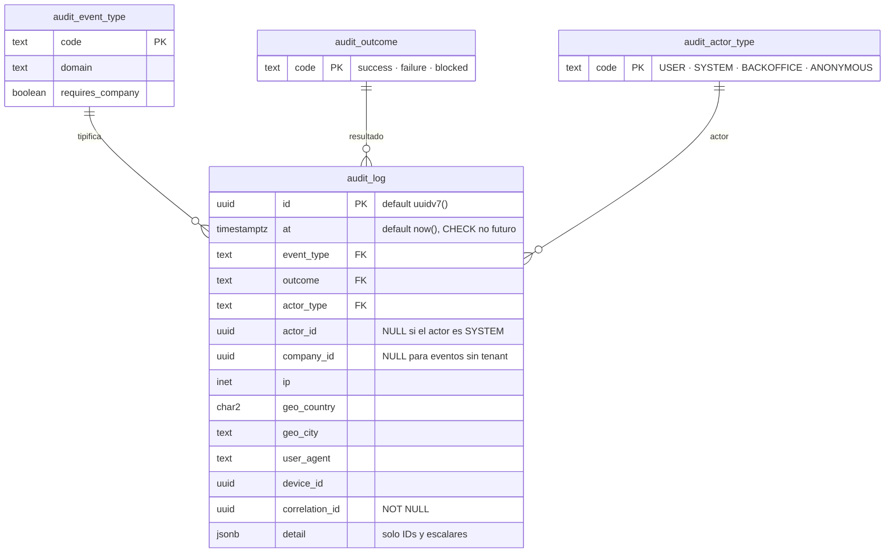

# Modelo de datos

> Se completa en cada paquete que cree tablas, **en el mismo commit**, con el diagrama de entidades actualizado.
> Estado: **P0**. Solo existe la tabla de auditoría y sus catálogos; el modelo de negocio empieza en P1.

## Reglas transversales

- `company_id` en **toda** tabla de negocio, sin excepción
- RLS deny-by-default; políticas creadas **en la misma migración que crea la tabla**, no después
- UUID v7 como clave pública · `numeric` para dinero y cantidades · `timestamptz` para fechas
- Enums en tabla de catálogo, no en tipo nativo
- Sin borrado físico en entidades auditables
- **La tabla de movimientos de inventario es append-only**: sin `UPDATE`, sin `DELETE`

Las tres primeras no dependen de que nadie se acuerde: `audit:migrations` las comprueba en cada commit, y su lista de tablas exentas está **vacía**.

## Lo que existe hoy (P0)

### `audit_log` — SEGURIDAD.md §10

Es la primera tabla del sistema a propósito: el registro tiene que existir antes que aquello que registra.

**Append-only en tres capas**, y cada una cubre lo que la anterior no alcanza:

| # | Capa | A quién alcanza |
|---|---|---|
| 1 | `REVOKE UPDATE, DELETE, TRUNCATE` para `costeo_app` | Al rol de la aplicación |
| 2 | Trigger `BEFORE UPDATE OR DELETE OR TRUNCATE ... FOR EACH STATEMENT` | **También a la dueña de la tabla** |
| 3 | Regla `append-only-cliente-audit_log` de `audit:forbidden` | Al código, antes de llegar a la base |

**El trigger es de SENTENCIA y no de fila, y la distinción no es cosmética.** Con `FORCE ROW LEVEL SECURITY` activo y sin política de `DELETE`, un `DELETE FROM audit_log` ejecutado por la dueña afecta a **cero filas**: un trigger de fila nunca llegaría a dispararse y el borrado «tendría éxito» en silencio. Es el tipo de fallo que solo se descubre cuando hace falta la evidencia y ya no está. Hay una prueba de integración por cada capa.

**RLS deny-by-default desde P0.** La aplicación solo puede **insertar** eventos de sistema, y **no puede leer** el log: consultarlo es del back office (P11). La prueba que lo verifica comprueba además que el `0` que ve la aplicación es la política y no una tabla vacía — sin esa segunda comprobación, pasaría igual con RLS desactivado.

**`company_id` es nullable a propósito, y lo seguirá siendo.** El catálogo de §10 incluye eventos que por naturaleza no tienen tenant: `system.migration.applied`, `system.config.changed`, `system.ratelimit.exceeded`, `admin.login.*`. P1 añade la clave foránea con `ON DELETE RESTRICT` —**jamás `CASCADE`**: borrar una company no puede borrar su rastro— y el `CHECK` condicional contra `audit_event_type.requires_company`.

### Restricciones que ya están puestas

| Restricción | Qué impide |
|---|---|
| `audit_log_at_no_es_futuro` | Fechar evidencia por delante del reloj del servidor |
| `audit_log_actor_coherente` | Un actor `SYSTEM` con `actor_id`, o un `USER` sin él |
| `audit_log_event_type_fkey` | Un tipo de evento que no está en el catálogo |

Los catálogos son tablas y no `enum` nativos porque **añadir un valor a un enum de PostgreSQL exige una migración con bloqueo**, y este catálogo crece en cada paquete.

## Entidades por paquete

| Paquete | Entidades | Estado |
|---|---|---|
| **P0** | `audit_log`, `audit_event_type`, `audit_outcome`, `audit_actor_type` | ✅ |
| P1 | `company`, `company_settings`, `user`, `session`, `role`, `permission`, `location`, `access_log` | ⬜ |
| P2 | `item`, `purchase_article`, `unit`, `unit_conversion`, `item_group` | ⬜ |
| P3 | `reference_price` | ⬜ |
| P4 | `product`, `product_location`, `recipe`, `recipe_line`, `combo_component`, `recipe_propagation_log` | ⬜ |
| P6 | `inventory_movement`, `inventory_balance` (proyección), `production_batch` | ⬜ |
| P7 | `period`, `physical_count`, `physical_count_line` | ⬜ |
| P8 | vistas materializadas de período cerrado | ⬜ |
| P10 | `import_job`, `import_row` | ⬜ |
| P11 | `plan`, `subscription`, `cross_tenant_access_log` | ⬜ |

## Índices

Ninguno de los de `CLAUDE.md` §5 aplica todavía: **ningún índice sin consulta que lo justifique.** `audit_log` lleva dos, y los dos tienen consumidor concreto en P11: `(at DESC)` para el listado cronológico y `(correlation_id)` para reconstruir todo lo ocurrido en una petición.
